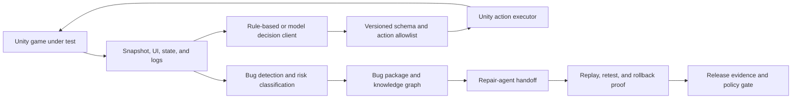

# Kibernet AI TestPilot

**Evidence-driven AI game QA for Unity.**

Kibernet AI TestPilot turns gameplay testing into a controlled engineering loop: capture a structured Unity state, choose an allowlisted action, detect and package failures, hand repair context to a coding agent, replay the exact scenario, and make the release decision from machine-readable evidence.

[](LICENSE)


> [!IMPORTANT]
> AI TestPilot is an early-access engineering project. Its core, Unity package, smoke tests, evidence contracts, and package-release gates are implemented. Production use still requires a game-specific replay driver, real endpoint credentials and live-smoke evidence when a model is enabled, and host-project evidence for production Lua or repair workflows.

> [!NOTE]
> Required PR gate:
> 1. run `.\tools\Run-DevGate.ps1`
> 2. paste/attach `Temp\developer-gate-manifest.json` in PR notes
> 3. explain any skipped steps with reasons in PR description

## 项目介绍（中文）

AI TestPilot 是面向 Unity 的“证据优先”游戏质量保障平台。它把“发现-复现-修复-回归”构建为一套可审计工作流：统一采集游戏状态与上下文证据、通过 allowlist 与版本化动作 schema 控制执行边界、自动封装问题包并驱动修复交接，最终将结果回流到可复测、可回放、可发布的证据链。

### 适用价值（为什么选它）

- 缩短回归定位时间：缺陷一旦发生可快速关联到具体日志、状态、截图与重放片段。
- 提高复现一致性：每条失败都生成可重放场景和标准化上下文，不再依赖口头描述。
- 降低 PR 风险：本地门禁与发布证据链可作为评审的硬约束，减少“看起来过了但没验证”的问题。
- 加速团队协同：测试、开发与修复流均使用统一 JSON/Markdown 产物，便于交接和追责。

### 项目许可

本项目采用 **MIT License**，支持大多数商业与合作场景；完整条款见 [LICENSE](LICENSE)。

### 行业落地适配（典型场景）

- **轻量级 QA 团队**：在现有 Unity 回归流程上补充 AI 辅助定位，减少重复手工执行、提升跨项目可复用性。
- **中型发布组织**：将“测试 - 修复 - 回归”链路标准化为可审计的证据资产，支持并行修复与复测闭环。
- **高频迭代项目**：通过预定义动作边界和统一证据格式，降低每次大版本上新时的回归风险。

### 对业务有价值的交付物

- **证据包**：`Temp\developer-gate-manifest.json`、`Temp\dev-gate-summary.json`、`Temp\ci-gate-summary.json`
- **可复测闭环**：修复任务、补丁前置校验、重测与回滚结果，全部留痕。
- **风险可控**：通过 allowlist 与 schema 限制执行行为，避免“模型幻觉”引入不可控动作。

## Why AI TestPilot

Game QA automation usually breaks at the boundaries between UI state, gameplay APIs, flaky replay steps, bug reports, repair tools, and CI. AI TestPilot provides one auditable contract across those boundaries.

- **Model-agnostic exploration**: Use deterministic policies, a native JSON model endpoint, or an OpenAI-compatible chat-completions gateway.
- **Constrained execution**: Model output is parsed against a versioned action schema and rejected unless it matches the allowlist.
- **Reproducible bugs**: Logs, state, steps, risk, source context, and artifacts are packaged into durable JSON and Markdown.
- **Repair-agent handoff**: Generate task-bound context, acceptance criteria, expected outputs, patch preflight, retest, and rollback evidence.
- **Learning from prior failures**: Persist a bug knowledge graph with module, failure-type, and fix-history signals.
- **Evidence-backed releases**: Gate releases on validated artifacts rather than optimistic status flags.

## System Flow



The runtime loop is intentionally narrow: an AI can propose an action, but it cannot bypass the product-owned schema, allowlist, executor, or release policy.

## Capabilities

| Area | What is implemented | Primary evidence |
| --- | --- | --- |
| Unity observation | `AutomationId`, UI extraction, game-state capture, log collection, snapshot serialization | Snapshot JSON and schema regression checks |
| Decision loop | Deterministic client, provider-neutral HTTP client, OpenAI-compatible request wrapper, prior fix hints | Per-step decision traces |
| Safe execution | Versioned action contract and allowlisted actions such as `click`, `wait`, login, scene entry, reward, and fishing flows | Parsed-action and validation results |
| Bug intelligence | Detection, risk classification, bug packages, persistent knowledge graph, recurring-module ranking | JSON and Markdown bug artifacts |
| Repair workflow | Structured repair task, agent handoff, output import, patch safety preflight, apply/retest/rollback probes | Task-bound patch and retest manifests |
| Replay integration | Configurable replay profiles and a production-driver contract for real game APIs | Driver descriptors and targeted retest reports |
| Release engineering | Repo validation, Unity batch validation, GitHub Actions, Azure Pipelines, risk policy, evidence index | Stable release-evidence bundle |
| Lua repair support | Static findings, deterministic sandbox patching, production evidence intake contract | Analysis, patch-plan, and readiness manifests |

## Quick Start

### Prerequisites

- Windows PowerShell 5.1 or PowerShell 7+
- .NET 8 SDK
- Unity 2021.3 LTS for package import and batchmode validation
- Git

### Clone and validate the core

```powershell
git clone https://github.com/kibernet/AITestPilot.git
cd AITestPilot
.\tools\Validate-AITestPilot.ps1
```

To include the CI gate path-resolution regression checks in the local validation run:

```powershell
.\tools\Validate-AITestPilot.ps1 -RunCiGatePathRegression
```

Quick command lookup (local development):

```text
.\tools\Run-DevGate.ps1
.\tools\Invoke-AITestPilotCiGate.ps1
.\tools\Invoke-AITestPilotLocalPreflight.ps1
.\tools\Validate-AITestPilot.ps1
.\tools\Validate-AITestPilot.ps1 -RunCiGatePathRegression
.\tools\Validate-AITestPilot.ps1 -RunCiGatePathRegressionStrict
Get-Help .\tools\Validate-AITestPilot.ps1 -Full
Get-Help .\tools\Test-AITestPilotCiGatePathResolution.ps1 -Full
```

See full local workflow cheat sheet: `.\docs\local-workflow-cheat-sheet.md`
It includes a minimum baseline command sequence and a PR/release preflight checklist for quick verification.

For one-click local preflight:

```powershell
.\tools\Invoke-AITestPilotLocalPreflight.ps1
```

For strict alias-conflict assertions (including `OutputPath` + `SummaryPath` conflict rejection), run:

```powershell
.\tools\Validate-AITestPilot.ps1 -RunCiGatePathRegressionStrict
```

This strict mode validates the regression in a stricter way, including native command binding conflict failures.

You can also inspect full parameter docs with:

```powershell
Get-Help .\tools\Validate-AITestPilot.ps1 -Full
```

For day-one onboarding and a one-command smoke path, run:

```powershell
.\tools\Invoke-AITestPilotQuickStart.ps1
```

Then run:

```powershell
.\tools\Invoke-AITestPilotQuickStartChecklist.ps1
```

For a post-change revalidation loop (core validation + optional patch apply + repair retest), run:

```powershell
.\tools\Invoke-AITestPilotRepairLoop.ps1
```

For a one-command local developer gate before PR/push, run:

```powershell
.\tools\Invoke-AITestPilotDeveloperGate.ps1
```

Or use the shorter command:

```powershell
.\tools\Run-DevGate.ps1
```

If you need a machine-readable copy for CI artifacts or local archival, use:

```powershell
.\tools\Run-DevGate.ps1 -SummaryPath Temp\dev-gate-summary.json
```

If you need the manifest written to a custom location, use:

```powershell
.\tools\Run-DevGate.ps1 -ManifestPath Temp\custom-developer-gate-manifest.json
```

`-ManifestPath` and `-SummaryPath` both accept absolute paths; otherwise paths are resolved relative to repository root.
`-OutputPath` is now accepted as an alias for `-SummaryPath` (for CI-style parity).
`-QuickStartOutputDir`, `-RepairLoopOutputDir`, and `-RepairLoopEvidenceBundleDir` are also resolved against repository root when relative (absolute values are preserved).

CI-friendly mode (optional, writes `Temp\ci-gate-summary.json` and exits non-zero on non-pass unless `-AllowPartialFail` is set):

```powershell
.\tools\Invoke-AITestPilotCiGate.ps1
```

To write to a custom summary path:

```powershell
.\tools\Invoke-AITestPilotCiGate.ps1 -SummaryPath Temp\ci-gate-summary.json
```

`-OutputPath` is also accepted as an alias of `-SummaryPath` for CI summary output.

To read/write a custom developer gate manifest path:

```powershell
.\tools\Invoke-AITestPilotCiGate.ps1 -ManifestPath Temp\custom-developer-gate-manifest.json
```

The command writes a quick-start manifest to:

```text
Temp\quick-start\quick-start-manifest.json
```

The developer gate writes:

```text
Temp\developer-gate-manifest.json
```

You can also run a local path-resolution regression check (relative/absolute paths + `OutputPath` alias + whitespace-in-path cases):

```powershell
.\tools\Test-AITestPilotCiGatePathResolution.ps1
```

To run strict path-regression assertions (including strict alias conflict checks), use:

```powershell
.\tools\Test-AITestPilotCiGatePathResolution.ps1 -StrictOutputPathAlias
```

And inspect parameter docs with:

```powershell
Get-Help .\tools\Test-AITestPilotCiGatePathResolution.ps1 -Full
```

This command builds the .NET solution, builds the model-endpoint and Lua-analysis probes, runs the dependency-free smoke suite, and validates the Unity package structure.

`Run-DevGate.ps1` also prints a machine-readable summary block that can be copied directly into the PR template, including quick start and repair-loop statuses.

### Install the Unity package

Add the package through Unity Package Manager with the Git URL:

```text
https://github.com/kibernet/AITestPilot.git?path=/unity/com.kibernet.ai-testpilot#main
```

For local development, use **Package Manager -> Add package from disk** and select:

```text
unity/com.kibernet.ai-testpilot/package.json
```

Then:

1. Add `AutomationId` to UI objects that should be visible to the test agent.
2. Open **Tools -> Kibernet -> AI TestPilot**.
3. Capture and inspect a snapshot.
4. Start with the deterministic rule-based loop before enabling a live model endpoint.
5. Integrate a production replay driver before treating package evidence as proof of real game behavior.

### Validate Unity import and the sample scene

```powershell
.\tools\Validate-UnityPackageImport.ps1
```

The command imports the package into a temporary Unity project, compiles Runtime and Editor assemblies, runs a generated sample scene, exercises the decision loop and bug flow, and writes release evidence under `Temp/release-evidence/latest`.

## Model Endpoint Integration

AI TestPilot supports two request formats:

- `NativeJson` for a provider-neutral decision endpoint.
- `OpenAICompatibleChatCompletions` for OpenAI-compatible or local gateways.

Create a settings asset from Unity:

```text
Tools/Kibernet/AI TestPilot/Create Model Endpoint Settings
```

The asset stores endpoint and model configuration but never stores the API key itself. Secrets are referenced through environment variables, and live requests are disabled by default.

For contracts, configuration, traces, retry policy, failure classification, and live-smoke requirements, see [Model Endpoint Bridge](docs/model-endpoint.md).

## Production Replay Integration

Real projects bind business actions through `IGameActionReplayDriver` or `HookedGameActionReplayDriver`. The standard integration surface covers account preparation, login, scene entry, reward claiming, and fishing; projects can register additional replay handlers without weakening the action boundary.

Generate a host-project starter kit:

```powershell
.\tools\New-AITestPilotProductionDriverBindingKit.ps1 `
  -DriverTypeName "Your.Game.Tests.ProductionReplayDriver" `
  -DriverId "your_game.production_replay"
```

The generated hooks fail closed until real game APIs and state verification are implemented. See [Production Replay Driver Integration](docs/integration/production-driver.md).

## Evidence, Safety, and Trust Boundaries

AI TestPilot is designed so that fixtures prove contracts without being presented as production proof.

- Unknown or malformed actions fail before touching the game.
- API keys are referenced by environment-variable name and are not serialized into evidence.
- External patches are checked for absolute paths, traversal, repository metadata, sensitive files, and out-of-scope targets.
- Main-worktree patch application requires an explicit switch, a clean baseline, accepted external-agent provenance, and a passing preflight.
- Retest and rollback results are recorded separately from patch generation.
- Fixture, sample, skipped, contract-mode, and real-provider evidence are explicitly distinguished.
- Production hard mode rejects unbound replay drivers, missing production Lua proof, or missing required live-endpoint evidence.

These boundaries are part of the release contract, not documentation-only promises. See [Architecture](docs/architecture.md) and [CI Release Pipeline](docs/ci-release-pipeline.md).

## CI and Release Gates

Run the full release pipeline with:

```powershell
.\tools\Invoke-AITestPilotReleasePipeline.ps1
```

The pipeline produces a stable artifact bundle under:

```text
artifacts/ai-testpilot-release/latest
```

Repository workflows are provided for:

- GitHub Actions on a self-hosted Windows runner with Unity 2021.3.
- Azure Pipelines on a self-hosted Windows pool with Unity 2021.3.

Optional hard-mode switches can require a production replay driver, production Lua patch evidence, and a real live-model smoke test. The default package pipeline deliberately does not claim that those host-project integrations already exist.

## Repository Layout

```text
AITestPilot/
├── src/Kibernet.AITestPilot.Core/          # Model-agnostic contracts and workflow logic
├── tests/Kibernet.AITestPilot.Core.SmokeTests/
├── unity/com.kibernet.ai-testpilot/        # Unity 2021.3 UPM package
├── tools/                                  # Validation, evidence, repair, and release scripts
├── docs/                                   # Architecture and integration documentation
├── .github/workflows/                      # GitHub Actions release gate
└── .azure-pipelines/                       # Azure Pipelines release gate
```

## Project Status

The current release is `0.1.0` and should be treated as early access.

**Ready today:**

- Core and Unity package development
- Deterministic exploration and offline model-contract validation
- Bug packaging, knowledge graph persistence, repair-task generation, and guarded retest workflows
- Package-level CI evidence and release-gate development

**Requires host-project integration:**

- Real login, account, gameplay, reward, and fishing APIs
- Real model credentials and provider smoke evidence when live decisions are required
- Real production Lua analysis, patch, retest, and rollback evidence
- Production repair-agent output against an actual game codebase

See the [Roadmap](docs/roadmap.md) for the implementation boundary and next milestones.

For contribution expectations and PR checklist, see [CONTRIBUTING.md](CONTRIBUTING.md).

## Contributing

Issues and pull requests are welcome. Contributions should preserve the project's core invariants:

1. Keep model output behind a versioned, validated action contract.
2. Do not serialize credentials or secret values into logs or evidence.
3. Distinguish fixture proof from real production evidence.
4. Add deterministic validation for new behavior.
5. Keep release-gate failures actionable and machine-readable.

Before opening a pull request, run:

```powershell
.\tools\Validate-AITestPilot.ps1
```

Unity-facing changes should also pass `Validate-UnityPackageImport.ps1` on Unity 2021.3.

## Documentation

- [Architecture](docs/architecture.md)
- [Model Endpoint Bridge](docs/model-endpoint.md)
- [Production Replay Driver Integration](docs/integration/production-driver.md)
- [Quick Start Demo](docs/quick-start-demo.md)
- [CI Release Pipeline](docs/ci-release-pipeline.md)
- [Roadmap](docs/roadmap.md)
- [Original Product Specification](Kibernet_AI_TestPilot_FULL_SPEC.md)

## License

Kibernet AI TestPilot is released under the [MIT License](LICENSE). Commercial use, modification, distribution, sublicensing, and use in closed-source products are permitted under the license terms.
