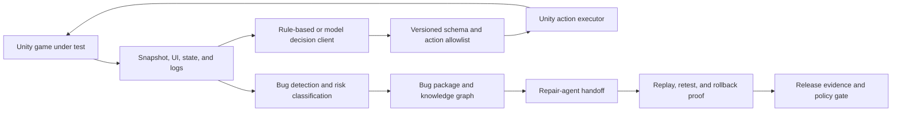

# Kibernet AI TestPilot

**Evidence-driven AI game QA for Unity.**

Kibernet AI TestPilot turns gameplay testing into a controlled engineering loop: capture a structured Unity state, choose an allowlisted action, detect and package failures, hand repair context to a coding agent, replay the exact scenario, and make the release decision from machine-readable evidence.

[](LICENSE)


> [!IMPORTANT]
> AI TestPilot is an early-access engineering project. Its core, Unity package, smoke tests, evidence contracts, and package-release gates are implemented. Production use still requires a game-specific replay driver, real endpoint credentials and live-smoke evidence when a model is enabled, and host-project evidence for production Lua or repair workflows.

> [!NOTE]
> Required PR gate:
> 1. run `.\tools\Run-DevGate.ps1`
> 2. paste/attach `Temp\developer-gate-manifest.json` in PR notes
> 3. explain any skipped steps with reasons in PR description

## 项目介绍

Kibernet AI TestPilot 是一款面向 Unity 的 AI 游戏测试工程化平台，核心目标是把“模型参与自动化”提升为可审计、可复现、可追责的生产流程。
它将每个测试动作固化为标准化闭环：**快照采集 → 决策 → 执行 → 诊断 → 修复协作 → 回测与发布验证**，并在每个节点沉淀机器可读证据。

在传统 QA 自动化里，问题往往不在“是否能跑通”，而在“是否可信、可解释、可复验”。AI TestPilot 的设计原则是：
**先约束、再执行、再验证、再放行**。

- 所有动作必须通过版本化 Schema 与 Allowlist 校验，避免越权行为。
- 每次缺陷都会输出结构化证据包（JSON + Markdown + Manifest），用于 PR、Issue 与里程碑追踪。
- 修复闭环包含补丁前置检查、环境重置回放、重测证明与回滚证据。
- 发布以证据状态为闸口，而非主观经验判断。

### 适用场景

- Unity 项目中的 Gameplay 回归稳定性验证。
- 需要将自动化测试与外部修复 Agent 的工作流打通的团队。
- 在 PR 评审前，需要机器可读证据支撑风险决策与上线授权的工程组织。

### 核心价值

- **可审计性**：统一 schema、时间戳与状态语义，支持事后追溯与合规复核。
- **可复现性**：回放配置、重测命令、失败证据一体化管理，可在新环境再次验证。
- **可协作性**：以结构化任务包承接修复动作，减少口头约定导致的理解偏差。
- **可发布性**：release evidence、补丁验收与回滚凭据形成统一发布闸口。

### 使用范围

- 提供 Unity 2021.3+ 兼容的验证链路与脚本化预检。
- 支持 PR / Issue / Milestone 的验收清单生成与联动。
- 将本地预检、修复验证、发布预检串联成统一工程流程。

### 项目里程碑（当前可见）

- **阶段一：** 建立完整的证据驱动闭环，覆盖测试、缺陷、修复、回测。
- **阶段二：** 建立发布门禁与路径回归的工程化治理。
- **阶段三：** 持续提升协作体验与策略可观察性，增强外部生态接口。

### 依赖与要求

- **技术栈：** Windows PowerShell 5.1+ / .NET 8 / Git / Unity 2021.3+
- **运行环境：** Windows 桌面（支持本地预检、批处理与证据生成）
- **前置能力：** 根据项目情况准备 Replay Driver 与模型接入配置

### 交付边界（DoD）

本项目当前版本偏向“平台化能力交付”，不替代游戏逻辑开发或业务功能设计。

- 本项目交付的是：测试证据链路、门禁脚本、模型约束能力、重放与回归能力、发布联动能力。
- 本项目不替代：游戏的业务 API 设计、账号体系、反作弊策略、第三方服务治理（这些需要接入方按其项目实现并对齐）。
- 对生产级上线，接入方需提供稳定的玩法状态与 replay 能力，并在 CI/CD 中接入对应证据产物。

### 实施标准

- **可靠性：** 关键证据链路具备失败重试、幂等输出与可回退策略。
- **可审计：** 关键事件具备 schema 校验、时间戳与状态机语义。
- **可复验：** 重测路径与回放配置在新环境可重放、可比对。
- **可交付：** 输出 manifest、summary 与检查清单可直接用于 PR 与里程碑评审。

### 采用该框架的典型成功指标

- 缺陷定位时间缩短：由“先观察再讨论”转为“证据驱动一次决策”。
- 回归重测可复现率提高：关键缺陷具备标准化重现证明。
- PR 质量门槛稳定：通过固定验收清单降低人工主观判断偏差。
- 发布风险透明化：发布前证据完整度和门禁状态可量化查看。

### 30 分钟快速起步（建议）

1. 克隆项目并完成一次本地基础校验：
   `.\tools\Validate-AITestPilot.ps1`
2. 按项目接入 `AutomationId`，完成一轮 `Unity` 示例采样。
3. 运行 `.\tools\Run-DevGate.ps1`，生成开发者门禁摘要。
4. 将 `Temp\developer-gate-manifest.json` 附在 PR 说明中用于初始评审。

### 最小验收清单（可直接用于里程碑开场）

若以下项无法通过，请先暂停进入下一阶段：

- 本地基础校验通过：`.\tools\Validate-AITestPilot.ps1` 返回非异常。
- 基础证据文件可落盘：`Temp\developer-gate-manifest.json`、`Temp\dev-gate-summary.json`、`Temp\release-readiness-report.md`。
- 至少一条缺陷路径生成完整证明链（snapshot、decision trace、bug package、回测片段）。
- 关键动作仍满足 allowlist/Schema 校验（含未知动作拒绝与异常动作审计记录）。
- 未接入真实生产 API 的项目，明确标注“fixture-only”，并避免将其作为生产上线证据。

### 常见问题（FAQ）

- **Q：项目是只能用于 Unity 2021.3+ 吗？**
  A：当前 release 流程围绕 Unity 2021.3+ 验证和打包，建议接入方按此基线启动；低版本需要额外验证。

- **Q：我能直接在生产环境接管全部发布？**
  A：当前定位是提供可审计的工程化能力；生产上线仍需接入方提供真实玩法 API、模型提供商真实 smoke 证据与 Lua 生产修复链路。

- **Q：模型行为为什么还要被限制？**
  A：为了防止越权执行与不可解释动作，AI 只在 Schema + Allowlist 与执行器网关内提交流程，所有动作都可回放和追溯。

- **Q：如果 PR 门禁失败该怎么办？**
  A：优先查看 `Temp\developer-gate-summary.json` 与 `Temp\pr-validation-checklist.md` 的第一轮失败分类，按失败域（预检/证据/发布）对应修正后重跑。

- **Q：我不想每次都手填 PR 说明，能否自动化？**
  A：可以。优先使用 `-GeneratePrChecklist` 与 `-PrChecklistPath` 生成粘贴块，再配合里程碑注入工具。

## Why AI TestPilot

Game QA automation usually breaks at the boundaries between UI state, gameplay APIs, flaky replay steps, bug reports, repair tools, and CI. AI TestPilot provides one auditable contract across those boundaries.

- **Model-agnostic exploration**: Use deterministic policies, a native JSON model endpoint, or an OpenAI-compatible chat-completions gateway.
- **Constrained execution**: Model output is parsed against a versioned action schema and rejected unless it matches the allowlist.
- **Reproducible bugs**: Logs, state, steps, risk, source context, and artifacts are packaged into durable JSON and Markdown.
- **Repair-agent handoff**: Generate task-bound context, acceptance criteria, expected outputs, patch preflight, retest, and rollback evidence.
- **Learning from prior failures**: Persist a bug knowledge graph with module, failure-type, and fix-history signals.
- **Evidence-backed releases**: Gate releases on validated artifacts rather than optimistic status flags.

## System Flow



The runtime loop is intentionally narrow: an AI can propose an action, but it cannot bypass the product-owned schema, allowlist, executor, or release policy.

## Capabilities

| Area | What is implemented | Primary evidence |
| --- | --- | --- |
| Unity observation | `AutomationId`, UI extraction, game-state capture, log collection, snapshot serialization | Snapshot JSON and schema regression checks |
| Decision loop | Deterministic client, provider-neutral HTTP client, OpenAI-compatible request wrapper, prior fix hints | Per-step decision traces |
| Safe execution | Versioned action contract and allowlisted actions such as `click`, `wait`, login, scene entry, reward, and fishing flows | Parsed-action and validation results |
| Bug intelligence | Detection, risk classification, bug packages, persistent knowledge graph, recurring-module ranking | JSON and Markdown bug artifacts |
| Repair workflow | Structured repair task, agent handoff, output import, patch safety preflight, apply/retest/rollback probes | Task-bound patch and retest manifests |
| Replay integration | Configurable replay profiles and a production-driver contract for real game APIs | Driver descriptors and targeted retest reports |
| Release engineering | Repo validation, Unity batch validation, GitHub Actions, Azure Pipelines, risk policy, evidence index | Stable release-evidence bundle |
| Lua repair support | Static findings, deterministic sandbox patching, production evidence intake contract | Analysis, patch-plan, and readiness manifests |

## Quick Start

### Prerequisites

- Windows PowerShell 5.1 or PowerShell 7+
- .NET 8 SDK
- Unity 2021.3 LTS for package import and batchmode validation
- Git

### Clone and validate the core

```powershell
git clone https://github.com/kibernet/AITestPilot.git
cd AITestPilot
.\tools\Validate-AITestPilot.ps1
```

To include the CI gate path-resolution regression checks in the local validation run:

```powershell
.\tools\Validate-AITestPilot.ps1 -RunCiGatePathRegression
```

Quick command lookup (local development):

```text
.\tools\Run-DevGate.ps1
.\tools\Invoke-AITestPilotCiGate.ps1
.\tools\Invoke-AITestPilotLocalPreflight.ps1
.\tools\Validate-AITestPilot.ps1
.\tools\Validate-AITestPilot.ps1 -RunCiGatePathRegression
.\tools\Validate-AITestPilot.ps1 -RunCiGatePathRegressionStrict
.\tools\Validate-AITestPilot.ps1 -RunReleaseDocsFreshnessRegression
.\tools\Validate-AITestPilot.ps1 -RunReplayProfileSchemaCheck -ReplayProfileJsonPath Temp\release-evidence\latest\sample-business-replay-profile.json
Get-Help .\tools\Validate-AITestPilot.ps1 -Full
Get-Help .\tools\Test-AITestPilotCiGatePathResolution.ps1 -Full
.\tools\Run-DevGate.ps1 -SummaryPath Temp\dev-gate-summary.json -GeneratePrChecklist
```

See full local workflow cheat sheet: `.\docs\local-workflow-cheat-sheet.md`
It includes a minimum baseline command sequence and a PR/release preflight checklist for quick verification.

For one-click local preflight:

```powershell
.\tools\Invoke-AITestPilotLocalPreflight.ps1
```

For a release-grade preflight (release pipeline + strict checks + docs-freshness regression):

```powershell
.\tools\Invoke-AITestPilotReleasePreflight.ps1
```

Generate a ready-to-paste milestone/PR readiness report:

```powershell
.\tools\Invoke-AITestPilotReleaseReadinessReport.ps1 -OutputPath Temp\release-readiness-report.md -IncludeRecommendedCommands
```

For strict automation (non-zero exit on any WARN/FAIL item):

```powershell
.\tools\Invoke-AITestPilotReleaseReadinessReport.ps1 -OutputPath Temp\release-readiness-report.md -IncludeRecommendedCommands -FailOnWarning
```

For machine-readable consumption in CI/automation:

```powershell
.\tools\Invoke-AITestPilotReleaseReadinessReport.ps1 -OutputPath Temp\release-readiness-report.md -SummaryOutputPath Temp\release-readiness-summary.json
```

One-command bundle (report + summary + PR snippet):

```powershell
.\tools\Invoke-AITestPilotReleaseReadinessBundle.ps1 -ReportOutputPath Temp\release-readiness-report.md -SummaryJsonPath Temp\release-readiness-summary.json -SnippetOutputPath Temp\release-readiness-pr-snippet.md
```

Structured automation consumption:

```powershell
$result = .\tools\Invoke-AITestPilotReleaseReadinessBundle.ps1 -ReportOutputPath Temp\release-readiness-report.md -SummaryJsonPath Temp\release-readiness-summary.json -SnippetOutputPath Temp\release-readiness-pr-snippet.md -PassThru
$result.GateStatus
```

Generate a PR-ready copy block from the machine-readable summary:

```powershell
.\tools\Invoke-AITestPilotReleaseReadinessSummary.ps1 -SummaryJson Temp\release-readiness-summary.json -OutputPath Temp\release-readiness-pr-snippet.md
```

One-command handoff block generation (prints to console by default):

```powershell
.\tools\Set-AITestPilotReleaseReadinessMilestoneNotes.ps1 -DryRun
```

Export the handoff block directly into a file (paste-ready):

```powershell
.\tools\Export-AITestPilotReleaseReadinessHandoff.ps1 -OutputPath Temp\release-readiness-handoff-block.md
```

Push the same generated block directly into a PR body / issue body / milestone description:

```powershell
.\tools\Set-AITestPilotReleaseReadinessMilestoneNotes.ps1 -PullRequestNumber 123
.\tools\Set-AITestPilotReleaseReadinessMilestoneNotes.ps1 -IssueNumber 456
.\tools\Set-AITestPilotReleaseReadinessMilestoneNotes.ps1 -MilestoneNumber 7
```

Append flags are forwarded to the readiness bundle generator (`-IncludeRecommendedCommands`, `-RequireReleasePipeline`, `-FailOnWarning`, `-IncludeFailedOnly`).

For a lighter local preflight variant, add `-SkipReleasePipeline`:

```powershell
.\tools\Invoke-AITestPilotReleasePreflight.ps1 -SkipReleasePipeline
```

To include the optional release-docs-freshness regression matrix in that flow:

```powershell
.\tools\Invoke-AITestPilotLocalPreflight.ps1 -RunReleaseDocsFreshnessRegression
```

For strict alias-conflict assertions (including `OutputPath` + `SummaryPath` conflict rejection), run:

```powershell
.\tools\Validate-AITestPilot.ps1 -RunCiGatePathRegressionStrict
```

This strict mode validates the regression in a stricter way, including native command binding conflict failures.

For stronger release-docs-freshness coverage (including malformed prior manifests and drift edge cases), run:

```powershell
.\tools\Validate-AITestPilot.ps1 -RunReleaseDocsFreshnessRegression
```

This mode is recommended before release-milestone PRs and before changing release-docs-freshness-related probe logic.

You can also inspect full parameter docs with:

```powershell
Get-Help .\tools\Validate-AITestPilot.ps1 -Full
```

For day-one onboarding and a one-command smoke path, run:

```powershell
.\tools\Invoke-AITestPilotQuickStart.ps1
```

Then run:

```powershell
.\tools\Invoke-AITestPilotQuickStartChecklist.ps1
```

For a post-change revalidation loop (core validation + optional patch apply + repair retest), run:

```powershell
.\tools\Invoke-AITestPilotRepairLoop.ps1
```

For a one-command local developer gate before PR/push, run:

```powershell
.\tools\Invoke-AITestPilotDeveloperGate.ps1
```

Or use the shorter command:

```powershell
.\tools\Run-DevGate.ps1
```

If you need a machine-readable copy for CI artifacts or local archival, use:

```powershell
.\tools\Run-DevGate.ps1 -SummaryPath Temp\dev-gate-summary.json
```

If you also want a copy-paste PR checklist block, use:

```powershell
.\tools\Run-DevGate.ps1 -SummaryPath Temp\dev-gate-summary.json -GeneratePrChecklist -PrChecklistPath Temp\pr-validation-checklist.md
Get-Content Temp\pr-validation-checklist.md
```

If you need the manifest written to a custom location, use:

```powershell
.\tools\Run-DevGate.ps1 -ManifestPath Temp\custom-developer-gate-manifest.json
```

`-ManifestPath` and `-SummaryPath` both accept absolute paths; otherwise paths are resolved relative to repository root.
`-OutputPath` is now accepted as an alias for `-SummaryPath` (for CI-style parity).
`-QuickStartOutputDir`, `-RepairLoopOutputDir`, and `-RepairLoopEvidenceBundleDir` are also resolved against repository root when relative (absolute values are preserved).

CI-friendly mode (optional, writes `Temp\ci-gate-summary.json` and exits non-zero on non-pass unless `-AllowPartialFail` is set):

```powershell
.\tools\Invoke-AITestPilotCiGate.ps1
```

To write to a custom summary path:

```powershell
.\tools\Invoke-AITestPilotCiGate.ps1 -SummaryPath Temp\ci-gate-summary.json
```

`-OutputPath` is also accepted as an alias of `-SummaryPath` for CI summary output.

To read/write a custom developer gate manifest path:

```powershell
.\tools\Invoke-AITestPilotCiGate.ps1 -ManifestPath Temp\custom-developer-gate-manifest.json
```

The command writes a quick-start manifest to:

```text
Temp\quick-start\quick-start-manifest.json
```

The developer gate writes:

```text
Temp\developer-gate-manifest.json
```

You can also run a local path-resolution regression check (relative/absolute paths + `OutputPath` alias + whitespace-in-path cases):

```powershell
.\tools\Test-AITestPilotCiGatePathResolution.ps1
```

To run strict path-regression assertions (including strict alias conflict checks), use:

```powershell
.\tools\Test-AITestPilotCiGatePathResolution.ps1 -StrictOutputPathAlias
```

And inspect parameter docs with:

```powershell
Get-Help .\tools\Test-AITestPilotCiGatePathResolution.ps1 -Full
```

This command builds the .NET solution, builds the model-endpoint and Lua-analysis probes, runs the dependency-free smoke suite, and validates the Unity package structure.

`Run-DevGate.ps1` prints a machine-readable summary block and can now also emit a PR-ready checklist block (`-GeneratePrChecklist`) that is easier to paste directly into the PR template, including quick-start, repair-loop, and replay-profile statuses.

### Install the Unity package

Add the package through Unity Package Manager with the Git URL:

```text
https://github.com/kibernet/AITestPilot.git?path=/unity/com.kibernet.ai-testpilot#main
```

For local development, use **Package Manager -> Add package from disk** and select:

```text
unity/com.kibernet.ai-testpilot/package.json
```

Then:

1. Add `AutomationId` to UI objects that should be visible to the test agent.
2. Open **Tools -> Kibernet -> AI TestPilot**.
3. Capture and inspect a snapshot.
4. Start with the deterministic rule-based loop before enabling a live model endpoint.
5. Integrate a production replay driver before treating package evidence as proof of real game behavior.

### Validate Unity import and the sample scene

```powershell
.\tools\Validate-UnityPackageImport.ps1
```

The command imports the package into a temporary Unity project, compiles Runtime and Editor assemblies, runs a generated sample scene, exercises the decision loop and bug flow, and writes release evidence under `Temp/release-evidence/latest`.

## 落地与验收（7/30 计划）

给团队提供一条可执行的上线节奏示例：先跑基础验证，再补齐 PR 发布门禁，最后完成正式发布闭环。

- **第 1-3 天（项目接入）**
  - 运行 `.\tools\Validate-AITestPilot.ps1` 与 `.\tools\Invoke-AITestPilotLocalPreflight.ps1`
  - 确认输出目录（默认 `Temp\`）并固定记录 `Manifest / Summary`
  - 完成 Unity 首次接入：添加 `AutomationId`，验证 sample scene 与关键驱动点

- **第 4-7 天（PR 阶段）**
  - 在 PR 模板中附 `Temp\developer-gate-manifest.json` 与 `Temp\dev-gate-summary.json`
  - 建立故障处理回放；将主要失败归类并提交修复计划
  - 完成 Replay Driver 集成的最小闭环（可回放场景 + 回归验证）

- **第 8-30 天（发布就绪）**
  - 完成路径回归与严格别名冲突检测：`Run-CiGatePathRegression` / `Run-CiGatePathRegressionStrict`
  - 形成发布决策台账与发布证据矩阵
  - 运行 `.\tools\Invoke-AITestPilotReleasePipeline.ps1`，确认可复用发布证据与清单

### 落地与验收清单

- `Temp\developer-gate-manifest.json`：开发门禁 manifest
- `Temp\dev-gate-summary.json`：PR 级开发门禁摘要
- `Temp\ci-gate-summary.json`：CI 门禁摘要
- `Temp\release-evidence\latest\`：发布证据集合
- `artifacts\ai-testpilot-release\latest\`：发布制品输出目录

更多说明请参考：
- [Rollout & Release Checklist](docs/rollout-and-release-checklist.md)
- [Release Gate Review Checklist](docs/release-gate-review-checklist.md)

## Model Endpoint Integration

AI TestPilot supports two request formats:

- `NativeJson` for a provider-neutral decision endpoint.
- `OpenAICompatibleChatCompletions` for OpenAI-compatible or local gateways.

Create a settings asset from Unity:

```text
Tools/Kibernet/AI TestPilot/Create Model Endpoint Settings
```

The asset stores endpoint and model configuration but never stores the API key itself. Secrets are referenced through environment variables, and live requests are disabled by default.

For contracts, configuration, traces, retry policy, failure classification, and live-smoke requirements, see [Model Endpoint Bridge](docs/model-endpoint.md).

## Production Replay Integration

Real projects bind business actions through `IGameActionReplayDriver` or `HookedGameActionReplayDriver`. The standard integration surface covers account preparation, login, scene entry, reward claiming, and fishing; projects can register additional replay handlers without weakening the action boundary.

Generate a host-project starter kit:

```powershell
.\tools\New-AITestPilotProductionDriverBindingKit.ps1 `
  -DriverTypeName "Your.Game.Tests.ProductionReplayDriver" `
  -DriverId "your_game.production_replay"
```

The generated hooks fail closed until real game APIs and state verification are implemented. See [Production Replay Driver Integration](docs/integration/production-driver.md).

## Evidence, Safety, and Trust Boundaries

AI TestPilot is designed so that fixtures prove contracts without being presented as production proof.

- Unknown or malformed actions fail before touching the game.
- API keys are referenced by environment-variable name and are not serialized into evidence.
- External patches are checked for absolute paths, traversal, repository metadata, sensitive files, and out-of-scope targets.
- Main-worktree patch application requires an explicit switch, a clean baseline, accepted external-agent provenance, and a passing preflight.
- Retest and rollback results are recorded separately from patch generation.
- Fixture, sample, skipped, contract-mode, and real-provider evidence are explicitly distinguished.
- Production hard mode rejects unbound replay drivers, missing production Lua proof, or missing required live-endpoint evidence.

These boundaries are part of the release contract, not documentation-only promises. See [Architecture](docs/architecture.md) and [CI Release Pipeline](docs/ci-release-pipeline.md).

## CI and Release Gates

Run the full release pipeline with:

```powershell
.\tools\Invoke-AITestPilotReleasePipeline.ps1
```

The pipeline produces a stable artifact bundle under:

```text
artifacts/ai-testpilot-release/latest
```

Repository workflows are provided for:

- GitHub Actions on a self-hosted Windows runner with Unity 2021.3.
- Azure Pipelines on a self-hosted Windows pool with Unity 2021.3.

Optional hard-mode switches can require a production replay driver, production Lua patch evidence, and a real live-model smoke test. The default package pipeline deliberately does not claim that those host-project integrations already exist.

## Repository Layout

```text
AITestPilot/
├─ src/Kibernet.AITestPilot.Core/          # Model-agnostic contracts and workflow logic
├─ tests/Kibernet.AITestPilot.Core.SmokeTests/
├─ unity/com.kibernet.ai-testpilot/        # Unity 2021.3 UPM package
├─ tools/                                  # Validation, evidence, repair, and release scripts
├─ docs/                                   # Architecture and integration documentation
├─ .github/workflows/                      # GitHub Actions release gate
└─ .azure-pipelines/                       # Azure Pipelines release gate
```

## Project Status

The current release is `0.1.0` and should be treated as early access.

**Ready today:**

- Core and Unity package development
- Deterministic exploration and offline model-contract validation
- Bug packaging, knowledge graph persistence, repair-task generation, and guarded retest workflows
- Package-level CI evidence and release-gate development

**Requires host-project integration:**

- Real login, account, gameplay, reward, and fishing APIs
- Real model credentials and provider smoke evidence when live decisions are required
- Real production Lua analysis, patch, retest, and rollback evidence
- Production repair-agent output against an actual game codebase

See the [Roadmap](docs/roadmap.md) for the implementation boundary and next milestones.

For contribution expectations and PR checklist, see [CONTRIBUTING.md](CONTRIBUTING.md).

## Contributing

Issues and pull requests are welcome. Contributions should preserve the project's core invariants:

1. Keep model output behind a versioned, validated action contract.
2. Do not serialize credentials or secret values into logs or evidence.
3. Distinguish fixture proof from real production evidence.
4. Add deterministic validation for new behavior.
5. Keep release-gate failures actionable and machine-readable.

Before opening a pull request, run:

```powershell
.\tools\Validate-AITestPilot.ps1
```

Unity-facing changes should also pass `Validate-UnityPackageImport.ps1` on Unity 2021.3.

## Documentation

- [Architecture](docs/architecture.md)
- [Model Endpoint Bridge](docs/model-endpoint.md)
- [Production Replay Driver Integration](docs/integration/production-driver.md)
- [Quick Start Demo](docs/quick-start-demo.md)
- [CI Release Pipeline](docs/ci-release-pipeline.md)
- [Rollout & Release Checklist](docs/rollout-and-release-checklist.md)
- [Release Gate Review Checklist](docs/release-gate-review-checklist.md)
- [Roadmap](docs/roadmap.md)
- [Original Product Specification](Kibernet_AI_TestPilot_FULL_SPEC.md)

## License

Kibernet AI TestPilot is released under the [MIT License](LICENSE). Commercial use, modification, distribution, sublicensing, and use in closed-source products are permitted under the license terms.

