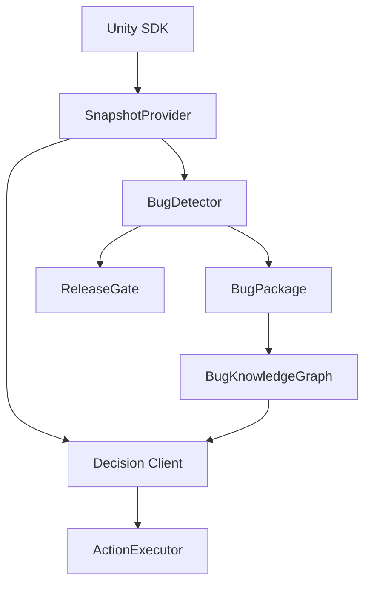

# AI TestPilot Architecture

## Runtime Flow



## Implemented Slice

The first implementation separates model-agnostic workflow code from the Unity package.

- Core library: deterministic contracts and smoke-tested behavior that can run outside Unity.
- Unity package: scene snapshot capture, UI element extraction through `AutomationId`, log collection, whitelisted action execution, and editor tooling.
- Editor bridge: captures snapshots and writes `bug_fix.md` prompts for Cursor.

## Integration Contracts

External model integration should implement the same decision contract:

```json
{
  "action": "click",
  "target": "Lobby.ActivityButton"
}
```

Only whitelisted actions are executable. Unknown actions fail validation before touching the game.

## Model Endpoint Bridge

`ModelEndpointDecisionClient` is the provider-neutral HTTP bridge for real model endpoints. It implements `IDecisionClient`, posts the goal, snapshot, previous steps, prior fix hints, allowed action list, and `ai-testpilot.action.v1` JSON schema to a configured endpoint, then parses a returned AI TestPilot action.

The parser accepts a direct action JSON object, common wrapper objects such as `decision` or `aiAction`, and text payloads that contain action JSON. The parsed action is validated through the same whitelist rules used by deterministic clients before any executor can touch the game.

When a trace directory is configured, the client writes one JSON artifact per step plus `latest-decision.json`. These records persist the system prompt, snapshot, outbound request JSON, raw model response JSON, parsed action, and pass/fail status, giving CI and repair agents an audit trail for model decisions.

`tools/Invoke-AITestPilotModelEndpointTraceProbe.ps1` exercises that same client through a deterministic local HTTP handler. It writes `model-endpoint-trace-manifest.json`, `model-endpoint-request.json`, `model-endpoint-response.json`, and `model-endpoint-decision-trace.json` into the release evidence bundle. This probe does not prove an external provider is reachable; it proves that the product-owned model contract, parser, action validation, and trace persistence path are intact.

`tools/Invoke-AITestPilotModelEndpointProviderDiagnostics.ps1` is the offline provider preflight. It writes `model-endpoint-provider-diagnostics-manifest.json` with native JSON, OpenAI chat completions, OpenAI-compatible gateway, and local OpenAI-compatible gateway presets; selected provider/request-format diagnostics; environment-variable readiness; and a `secretsSerialized=false` guarantee.

`tools/Invoke-AITestPilotLiveModelEndpointFailureProbe.ps1` is the deterministic negative model-endpoint probe. It drives `ModelEndpointDecisionClient` through a local HTTP 401 handler, writes `live-model-endpoint-failure-probe-manifest.json` and `live-model-endpoint-failure-probe-decision-trace.json`, and passes only when the failure is classified as `auth` with actionable remediation and a non-retryable escalation policy while preserving request-contract evidence.

`tools/Invoke-AITestPilotLiveModelEndpointSmoke.ps1` is the explicit live-network companion. It reads `AITESTPILOT_LIVE_MODEL_ENDPOINT`, `AI_TESTPILOT_MODEL_API_KEY`, and `AITESTPILOT_LIVE_MODEL`, calls the real endpoint through `ModelEndpointDecisionClient`, validates the returned action, and writes `live-model-endpoint-smoke-manifest.json` plus `live-model-endpoint-decision-trace.json`. Without those environment variables it records `status=SKIPPED`; `-RequireLive` or pipeline `-RequireLiveModelEndpointSmoke` makes skipped or failed live validation block release. Failed live manifests include category-specific remediation and retry/escalation policy for auth, rate limit, endpoint, provider outage, timeout, network, empty response, response contract, configuration, and unknown failures. The PowerShell wrapper executes retryable policies, caps them with `-MaxPolicyRetries` and `-MaxRetryBackoffSeconds`, and writes per-attempt evidence before returning final status.
For local OpenAI-compatible gateways with auth intentionally disabled, `-AllowMissingApiKey` and pipeline `-AllowMissingModelApiKey` mark the live smoke manifest with `apiKeyRequired=false`; the release gate still requires endpoint, model, request, response, and trace validation.

The Unity package owns the editor-facing configuration through `ModelEndpointSettings`. `Tools/Kibernet/AI TestPilot/Create Model Endpoint Settings` creates an asset under `Assets/AITestPilotGenerated/ModelEndpointSettings.asset`. The asset stores the endpoint URL, model name, authorization scheme, API-key environment variable name, timeout, trace directory, live-request flag, and system prompt. It does not store secrets, and generated sample settings keep live requests disabled.

`ModelEndpointSettings` can use either `NativeJson` or `OpenAICompatibleChatCompletions`. The chat-completions wrapper embeds the same AI TestPilot decision contract inside `messages` and asks for `response_format.type=json_object`, so OpenAI-compatible gateways can be used without accepting the native root JSON object directly.

Sample-scene validation now creates that settings asset and validates the Unity request contract offline. The scene evidence records `modelEndpoint` details, and the release manifest summary exposes `modelEndpointContractPassed`, the settings asset path, request format, live-request state, action schema version, and OpenAI-compatible wrapper proof.

## Production Replay Integration Checklist

The Unity package includes a `ProductionReplayIntegrationPlan` ScriptableObject for planning the real game replay driver before the project-specific APIs are available. The editor utility creates `Assets/AITestPilotGenerated/ProductionReplayIntegrationPlan.asset` with required hook bindings for account preparation, login, scene entry, reward claiming, and fishing.

Sample-scene validation validates that template and records `productionReplayIntegration` in scene evidence. The exported checklist files are `production-replay-integration-checklist.json` and `production-replay-integration-checklist.md`. They intentionally report `status=TEMPLATE_READY`, `realProjectBound=false`, zero bound required hooks, and five unresolved required hooks, so release evidence separates "handoff surface exists" from "real production game driver is implemented."

## Validation Boundary

`tools/Validate-AITestPilot.ps1` proves the repo-side core behavior and package shape.

`tools/Validate-UnityPackageImport.ps1` creates or reuses a temporary Unity project under `Temp/UnityImportProject`, imports the local package, verifies that Unity produces both Runtime and Editor assemblies, then runs `AITestPilotBatchValidator.RunSampleSceneValidation`.

The sample-scene validation builds and saves `Assets/AITestPilotGenerated/BasicAutomation.unity` inside the temporary Unity project, captures a snapshot through the SDK, validates the serialized snapshot JSON contract, lets the local rule client choose a click, executes that click, runs `DecisionLoopRunner` through a three-step goal, packages a synthetic exception log, reuses a graph fix hint, and writes evidence to `Temp/ai-testpilot-scene-validation.json`.

The evidence file now has three durable layers:

- `snapshotSchemaVersion` and `snapshotJson`: regression evidence for the serialized AI model input contract.
- `modelEndpoint`: Unity model endpoint settings, offline request-contract proof, prior fix hint evidence, action schema version, and parsed action evidence.
- `productionReplayIntegration`: template readiness evidence for the real game replay driver handoff, explicitly marked unbound until production APIs are wired.
- `multiStepRunner`: `DecisionLoopRunner` evidence proving three consecutive click actions and max-step termination.
- `runReports`: exploration, bug-detection, and retest run summaries.
- `bugPackage`: the standalone source bug package with identity, risk, module/function, log, stack trace, and reproduction steps.
- `bugKnowledgeGraph`: durable graph export with bug nodes, module risk ranking, and module/failure-type risk ranking.
- `retestReport`: links the high-risk bug run to the passing retest run.
- `repairTask`: gives Cursor or another fixing agent the bug, source run, reproduction steps, fix hint, retest command, and acceptance criteria.
- `repairAgentHandoff`: Cursor-ready handoff with launch command and required context files.
- `repairAgentRun`: execution tracking state, external-agent boundary, expected patch outputs, and post-patch retest command.
- `releaseEvidence`: summarizes gate checks and blocks release when high-risk bugs are not verified.

The validation script also writes a CI-friendly bundle under `Temp/release-evidence/latest`:

- `manifest.json`: PASS/FAIL summary and release decision fields.
- `scene-validation.json`: full report evidence.
- `bug-package.json` and `bug-package.md`: machine-readable and agent-readable source bug package.
- `bug-knowledge-graph.json` and `bug-knowledge-graph.md`: graph nodes, module risk ranking, and module/failure-type risk ranking for recurring-bug analysis.
- `repair-task.json` and `repair-task.md`: machine-readable and agent-readable repair instructions.
- `repair-agent-handoff.json` and `repair-agent-handoff.md`: repair-agent launch context, required files, and retest command.
- `repair-agent-run.json` and `repair-agent-run.md`: execution status, patch output slots, and next required actions.
- `repair-agent-patch-output-manifest.json`: imported patch-output evidence for patch and summary artifacts.
- `repair-agent.patch` and `repair-agent-summary.md`: repair-agent patch and human-readable summary outputs. Deterministic sample outputs validate the import path without claiming an external agent ran.
- `repair-agent-external-completion-failure-probe-manifest.json`: proof that pending repair-agent runs cannot be promoted to external-agent output just because patch files exist.
- `repair-agent-external-completion-failure-probe-import-manifest.json`: rejected patch-output import manifest from the pending-run failure probe.
- `repair-agent-generic-patch-import-probe-manifest.json`: proof that verified external-agent patch import is not tied to the deterministic sample null-guard snippet.
- `repair-agent-generic.patch`, `repair-agent-generic-summary.md`, `repair-agent-generic-patch-output-manifest.json`, and `repair-agent-generic-patch-preflight-manifest.json`: generic external-agent patch import probe artifacts.
- `repair-agent-source-snapshot-apply-validate-manifest.json`: proof that a verified external-agent patch can apply to a clean temporary repository copied from the current source tree, pass repo validation, and roll back.
- `repair-agent-source-snapshot-apply-validate-guard-manifest.json`, `repair-agent-source-snapshot-apply-validate-preflight-manifest.json`, `repair-agent-source-snapshot-apply-validate-rollback.patch`, `repair-agent-source-snapshot-apply-validate-rollback-plan.md`, `repair-agent-source-snapshot-apply-validate.patch`, and `repair-agent-source-snapshot-apply-validate.log`: source snapshot apply/validate probe artifacts.
- `repair-agent-external-patch-preflight-manifest.json`: target-path safety preflight for imported repair-agent patches.
- `repair-agent-external-patch-preflight-failure-probe-manifest.json`: proof that unsafe path traversal patch output is blocked.
- `repair-agent-external-patch-preflight-unsafe-manifest.json` and `repair-agent-external-patch-preflight-unsafe.patch`: failure-probe artifacts for the rejected unsafe patch.
- `repair-agent-repository-patch-apply-guard-manifest.json`: real-repository apply decision, explicit switch, clean-worktree, external-source, and no-mutation evidence.
- `repair-agent-repository-patch-rollback-plan.md`: rollback instructions or a no-rollback-required explanation for blocked apply attempts.
- `repair-agent-repository-worktree-before.txt` and `repair-agent-repository-worktree-after.txt`: source worktree snapshots around the repository apply guard.
- `repair-agent-repository-patch-apply-clean-probe-manifest.json`: clean temporary repository apply/rollback proof for external-agent patch output.
- `repair-agent-repository-patch-clean-apply-guard-manifest.json`, `repair-agent-repository-patch-clean-apply-preflight-manifest.json`, `repair-agent-repository-patch-clean-apply-rollback.patch`, `repair-agent-repository-patch-clean-apply-rollback-plan.md`, and `repair-agent-repository-patch-clean-apply.patch`: clean apply probe artifacts.
- `repair-agent-repository-patch-apply-clean-retest-manifest.json`: clean temporary repository apply/retest/rollback proof for verified external-agent patch output.
- `repair-agent-repository-patch-clean-apply-retest-guard-manifest.json`, `repair-agent-repository-patch-clean-apply-retest-preflight-manifest.json`, `repair-agent-repository-patch-clean-apply-retest-rollback.patch`, `repair-agent-repository-patch-clean-apply-retest-rollback-plan.md`, `repair-agent-repository-patch-clean-apply-retest.patch`, and `repair-agent-repository-patch-clean-apply-retest-repair-retest-manifest.json`: clean apply/retest probe artifacts.
- `repair-agent-patch-apply-retest-manifest.json`: sandbox patch application and post-patch retest evidence.
- `repair-agent-patch-apply-sandbox/Assets/SampleModule/StartButton.cs`: patched sandbox fixture proving the sample diff can be applied without mutating repo source.
- `production-replay-integration-checklist.json` and `production-replay-integration-checklist.md`: required production driver hook checklist and current binding status.
- Unity import and sample-scene validation logs.

`tools/Invoke-AITestPilotRepairAgentPatchOutputImport.ps1` consumes `repair-agent-run.json`, validates `repair-agent.patch` and `repair-agent-summary.md`, and writes `repair-agent-patch-output-manifest.json`. The release pipeline runs it with `-GenerateSampleOutput`, so CI proves the import, manifest, and gate checks while preserving `externalAgentRun=false`. For non-sample output, the importer requires `-ConfirmExternalAgentCompleted` plus run evidence showing `status=EXTERNAL_AGENT_COMPLETED`, `agentLaunched=true`, `patchOutputStatus=PRODUCED`, required outputs marked produced, and a nonzero output count.

`tools/Invoke-AITestPilotRepairAgentExternalCompletionFailureProbe.ps1` copies the pending run evidence into an isolated bundle, adds patch and summary files, then confirms the importer rejects that state as `external_agent_unverified`. This keeps the product boundary explicit: patch files alone are not proof that Cursor or another external repair agent actually ran.

`tools/Invoke-AITestPilotRepairAgentGenericPatchImportProbe.ps1` proves the real external-agent import path is not sample-specific. It marks a temporary run copy as externally completed, imports a generic unified diff that does not contain the deterministic `reward == null` sample snippet, runs the external patch preflight, and records that the verified external-agent patch is safe to inspect while `mainRepositoryPatchApplied=false`.

`tools/Invoke-AITestPilotRepairAgentSourceSnapshotApplyValidate.ps1` takes the next step toward real repository application without touching the main worktree. It copies the current source tree into a clean temporary git repository, imports a verified external-agent patch, runs the same repository apply guard with `-ApplyToRepository`, runs `Validate-AITestPilot.ps1` inside the candidate repository, generates rollback evidence that includes newly added files, applies the rollback, and verifies the candidate repository returns to clean state.

`tools/Invoke-AITestPilotMainWorktreeApplyReadiness.ps1` records the remaining main-worktree boundary before a real repository apply. It reads the source snapshot apply/validate proof, captures the current main repository status while filtering generated evidence directories, and writes `repair-agent-main-worktree-apply-readiness-manifest.json` plus status snapshots. This distinguishes validated apply mechanics from baseline cleanliness: dirty source baselines remain blocked with machine-readable reasons, while a clean source baseline is recorded as ready for the explicit external patch apply gate.

`tools/Invoke-AITestPilotRepairAgentExternalPatchPreflight.ps1` parses the imported unified diff before any apply step. It rejects absolute paths, path traversal, `.git` metadata, sensitive file names, and paths outside allowed repo/project prefixes, then writes `repair-agent-external-patch-preflight-manifest.json`. `repositoryApplyAllowed=true` is reserved for verified `external_agent` patch output with a passing safety preflight; deterministic samples and unverified external outputs remain blocked. `tools/Invoke-AITestPilotRepairAgentExternalPatchPreflightFailureProbe.ps1` injects an unsafe `../outside.txt` patch and expects the preflight to fail with `path_traversal` evidence.

`tools/Invoke-AITestPilotRepairAgentRepositoryPatchApplyGuard.ps1` is the real-worktree application gate. By default it does not apply a patch; it records `applyDecision=BLOCKED`, requires the explicit `-ApplyToRepository` switch, checks source worktree cleanliness, requires `external_agent` patch output, consumes the external patch preflight decision, and writes before/after worktree snapshots plus a rollback plan. When all real-application conditions are met in a clean worktree, it can apply the patch and export a reverse rollback patch, but the deterministic sample path remains blocked.

`tools/Invoke-AITestPilotRepairAgentRepositoryPatchApplyCleanProbe.ps1` proves that positive path safely in a clean temporary git repository. It marks a temporary repair-agent run copy as externally completed, imports the patch as verified `external_agent` output, runs preflight, applies the patch through the same guard with `-ApplyToRepository`, verifies the fixture changed, applies the generated rollback patch, verifies the fixture returned to its original state, and records `mainRepositoryPatchApplied=false`.

`tools/Invoke-AITestPilotRepairAgentRepositoryPatchApplyCleanRetest.ps1` extends that positive path through the retest sequence. It applies the verified external-agent patch in a clean temporary git repository, runs `Invoke-AITestPilotRepairRetest.ps1` before rollback, snapshots the retest manifest, then applies the generated rollback patch and verifies the temporary worktree is clean. This proves the apply-to-retest ordering without mutating the main repository.

`tools/Invoke-AITestPilotRepairAgentPatchApplyRetest.ps1` consumes that patch output manifest, applies the deterministic sample patch inside the evidence-bundle sandbox, runs the post-patch retest command, and writes `repair-agent-patch-apply-retest-manifest.json`. It records `repositoryPatchApplied=false`, so this step proves orchestration and patch mechanics without claiming the sample diff changed production code.

`tools/Invoke-AITestPilotRepairRetest.ps1` consumes a specific `repair-task.json` from that bundle. It runs `RepairTaskRetestRunner.RunRepairTaskRetest` in Unity batchmode, replays the task's reproduction steps, verifies the original bug signature is absent, and writes:

- `repair-retest.json`: targeted retest evidence.
- `repair-retest-manifest.json`: CI-friendly retest summary.
- `sample-business-replay-profile.json`: replay profile exported from the Unity `ActionReplayProfile` asset.
- Unity import and retest logs for the targeted run.

`tools/Invoke-AITestPilotReplayProfileImport.ps1` validates the opposite direction for non-Unity authoring workflows. It imports a replay profile JSON into an editable `ActionReplayProfile` asset, exports a normalized JSON copy, and writes:

- `replay-profile-import.json`: full import evidence.
- `replay-profile-import-manifest.json`: CI-friendly import summary.
- `imported-replay-profile.normalized.json`: JSON exported from the imported asset.
- Unity import and replay-profile import logs.

`tools/Invoke-AITestPilotReleaseGate.ps1` is the repo-side release gate over the evidence bundle. It requires:

- scene validation manifest with release allowed and no unverified high-risk bugs.
- repair-agent patch output import manifest with patch and summary artifacts.
- external completion failure probe manifest proving pending repair-agent runs cannot be promoted to external-agent output.
- generic external patch import probe manifest proving real external-agent patch import is not tied to the deterministic sample null-guard snippet.
- source snapshot apply/validate/rollback probe manifest proving verified external-agent patches can apply to a clean candidate made from current source, pass repo validation, and roll back newly added files.
- main worktree apply readiness manifest proving whether current main repository application is blocked by source baseline cleanliness or ready for the explicit external patch apply gate while source snapshot apply mechanics are validated.
- external repair-agent patch preflight manifest and unsafe-path failure probe.
- repository patch apply guard manifest proving real source mutation is blocked without explicit switch, external source, clean worktree, and rollback evidence.
- clean temporary repository apply/rollback probe manifest proving explicit external-agent apply and rollback mechanics without mutating the main repository.
- clean temporary repository apply/retest/rollback probe manifest proving post-apply retest runs before rollback without mutating the main repository.
- repair-agent patch apply/retest manifest with sandbox application and post-patch retest evidence.
- targeted repair retest manifest with the full business replay path.
- driver descriptor with standard handler support and configuration requirements.
- negative driver failure probe manifest and log diagnostics.
- replay profile import manifest and listed files.
- model endpoint trace manifest, request/response artifacts, and persisted decision trace.
- model endpoint provider diagnostics manifest with supported presets, request formats, selected preset, environment bindings, and no serialized secrets.
- live model endpoint failure probe manifest proving auth failures are classified with remediation, retry/escalation policy, and a failed trace.
- live model endpoint smoke manifest, skipped/pass/fail status, policy-driven retry attempts, and persisted live decision trace when explicitly configured.
- Unity scene manifest summary proving model endpoint settings and offline request-contract evidence.
- Unity scene manifest summary proving `DecisionLoopRunner` multi-step execution and max-step termination.
- Unity scene manifest summary proving the production replay integration checklist was exported and is still marked unbound until real project hooks exist.

`tools/Invoke-AITestPilotReleaseGateFailureProbe.ps1` copies the current bundle, removes the driver failure probe evidence, and expects the release gate to block that copy.

`tools/Invoke-AITestPilotReleasePipeline.ps1` runs the full chain, including deterministic repair-agent patch output import, external completion failure probe, generic external patch import probe, source snapshot apply/validate probe, main worktree apply readiness, external patch safety preflight, unsafe-path failure probe, repository apply guard, clean temporary repository apply/rollback probe, clean temporary repository apply/retest/rollback probe, and sandbox patch apply/retest, then copies the final evidence bundle to `artifacts/ai-testpilot-release/latest` with `pipeline-manifest.json`, giving CI one stable command and artifact directory.

## Replay Adapters

Repair-task retests use `ActionReplayRegistry` instead of calling `ActionExecutor` directly. The registry tries custom `IActionReplayAdapter` implementations first, then falls back to the default `ActionExecutor` adapter.

Games can register adapters for domain actions such as `prepare_account`, `login`, `enter_scene`, `claim_reward`, `play_fishing`, or feature-specific UI flows. They can also create an `ActionReplayProfile` ScriptableObject where each action/target maps to a handler key. `ConfiguredActionReplayAdapter` uses that profile and dispatches each rule to handlers registered in `ActionReplayHandlerRegistry`.

For production integration, game projects implement `IGameActionReplayDriver` and register it through `GameActionReplayDriverBindings.RegisterStandardHandlers(driver)`. The standard binding exposes handler keys for account preparation, login, scene entry, reward claiming, and fishing without requiring each project to hand-wire profile handlers.

Batch retests resolve the driver in a production-friendly order: a type passed with `-aiTestPilotGameReplayDriverType`, a driver registered through `GameActionReplayDriverRegistry.Register(...)`, then the sample fallback. Drivers can implement `IGameActionReplayStateProvider` to expose business-action counters in retest evidence.

The preferred production adapter path is `HookedGameActionReplayDriver`: the package owns replay-result conversion, state counters, and diagnostics, while the game project implements `IGameActionReplayHooks` against its own login, account, scene, activity, and fishing APIs.
Production drivers declare a `GameActionReplayDriverDescriptor` with supported handler keys and required configuration such as account aliases, server/shard settings, or repair-task targets. Repair retest evidence records that descriptor and the wrapper validates that it matches the selected driver.
The failure probe runs a deliberately failing hooked driver and expects Unity batchmode to exit nonzero. The probe passes only when the Unity log contains the failing driver id, handler key, action, target, and step, which keeps production adapter errors diagnosable in CI.
The release gate consumes both the positive and negative manifests, so a driver that only proves the happy path is not considered release-ready.

The generated sample repair task now exercises a business-style path: `prepare_account:qa_smoke_account`, `login:qa_smoke_account`, `enter_scene:Activity`, `claim_reward:Activity.ClaimReward`, and `play_fishing:CastLine`. Targeted retest evidence must show `profile.sample_business_flow` handled those steps through five configured `game.*` handler keys, that `sample.game_project_driver` was used, and that account, login, scene entry, reward claim, and fishing counters each ran once.

The targeted retest creates `Assets/AITestPilotGenerated/SampleBusinessReplayProfile.asset` inside the temporary Unity project, so the replay profile can be inspected and edited through Unity. It also exports the same profile to `sample-business-replay-profile.json` in the evidence bundle for CI and external agents. The import gate proves that the same JSON can be authored outside Unity and converted back into `Assets/AITestPilotGenerated/ImportedReplayProfile.asset`.
