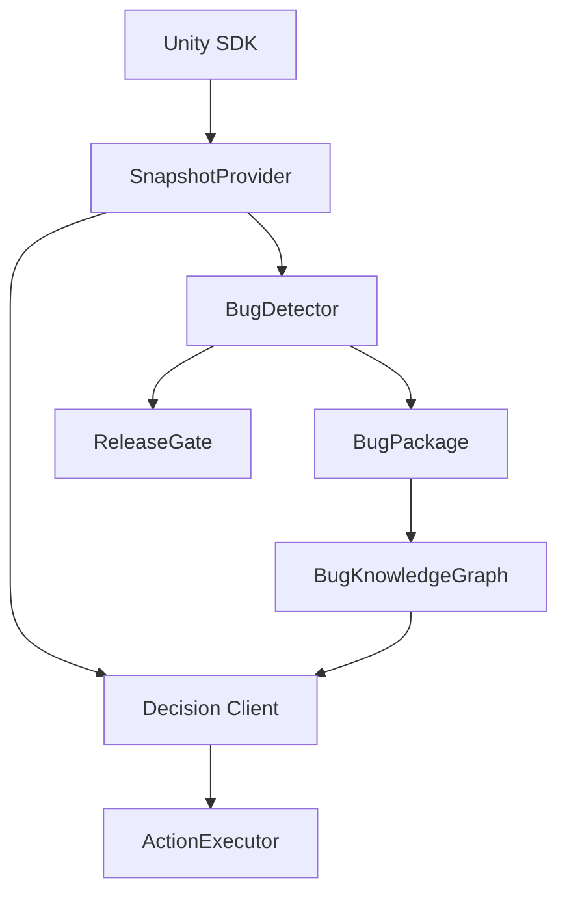

# AI TestPilot Architecture

## Runtime Flow



## Implemented Slice

The first implementation separates model-agnostic workflow code from the Unity package.

- Core library: deterministic contracts and smoke-tested behavior that can run outside Unity.
- Unity package: scene snapshot capture, UI element extraction through `AutomationId`, log collection, whitelisted action execution, and editor tooling.
- Editor bridge: captures snapshots and writes `bug_fix.md` prompts for Cursor.

## Integration Contracts

External model integration should implement the same decision contract:

```json
{
  "action": "click",
  "target": "Lobby.ActivityButton"
}
```

Only whitelisted actions are executable. Unknown actions fail validation before touching the game.

## Model Endpoint Bridge

`ModelEndpointDecisionClient` is the provider-neutral HTTP bridge for real model endpoints. It implements `IDecisionClient`, posts the goal, snapshot, previous steps, prior fix hints, allowed action list, and `ai-testpilot.action.v1` JSON schema to a configured endpoint, then parses a returned AI TestPilot action.

The parser accepts a direct action JSON object, common wrapper objects such as `decision` or `aiAction`, and text payloads that contain action JSON. The parsed action is validated through the same whitelist rules used by deterministic clients before any executor can touch the game.

When a trace directory is configured, the client writes one JSON artifact per step plus `latest-decision.json`. These records persist the system prompt, snapshot, outbound request JSON, raw model response JSON, parsed action, and pass/fail status, giving CI and repair agents an audit trail for model decisions.

`tools/Invoke-AITestPilotModelEndpointTraceProbe.ps1` exercises that same client through a deterministic local HTTP handler. It writes `model-endpoint-trace-manifest.json`, `model-endpoint-request.json`, `model-endpoint-response.json`, and `model-endpoint-decision-trace.json` into the release evidence bundle. This probe does not prove an external provider is reachable; it proves that the product-owned model contract, parser, action validation, and trace persistence path are intact.

`tools/Invoke-AITestPilotModelEndpointProviderDiagnostics.ps1` is the offline provider preflight. It writes `model-endpoint-provider-diagnostics-manifest.json` with native JSON, OpenAI chat completions, OpenAI-compatible gateway, and local OpenAI-compatible gateway presets; selected provider/request-format diagnostics; environment-variable readiness; and a `secretsSerialized=false` guarantee.

`tools/Invoke-AITestPilotModelEndpointProviderRetryPolicyProbe.ps1` is the offline provider retry-policy preflight. It reads provider diagnostics and writes `model-endpoint-provider-retry-policy-manifest.json`, covering the supported provider presets and live failure categories with retry counts, backoff ceilings, escalation owners, alert routes, release-gate actions, and recommended production CI live-smoke retry arguments.

`tools/New-AITestPilotLiveModelEndpointConfigKit.ps1` generates the host-project configuration template for live model endpoint rollout. It writes `live-model-endpoint-config.json`, schema guidance, and a runbook while keeping the default config pending, secret-free, and not live-smoked. `tools/Invoke-AITestPilotLiveModelEndpointConfigIntake.ps1` reads that config from repo-local or external host-project directories and can require complete non-secret configuration before live smoke is allowed. `tools/Invoke-AITestPilotLiveModelEndpointConfigKitProbe.ps1` adds the pending kit to release evidence, proves the accepted static config contract with an isolated fixture, and proves an incomplete repo-external config is read and blocked without claiming provider access.

`tools/Invoke-AITestPilotLiveModelEndpointSmokeEvidenceIntake.ps1` is the host-project live-smoke evidence intake. It reads `live-model-endpoint-smoke-manifest.json` and `live-model-endpoint-decision-trace.json` from a provided evidence directory, accepts only real `status=PASS` live HTTP smoke evidence with validated action and trace contract fields, and can promote accepted evidence to the canonical release-gate filenames. Production readiness requires direct smoke-manifest provenance from the real provider path, including `fixtureOnly=false`, `contractFixtureMode=false`, `realProviderAccessProven=true`, `liveSmokeExecuted=true`, `productionLiveEndpointAccessProven=true`, `evidenceProvenance=direct_live_http_endpoint_pass`, `endpointMode=live_http_endpoint`, and `clientType=ModelEndpointDecisionClient`. `tools/Invoke-AITestPilotLiveModelEndpointExternalSmokeIntakeProbe.ps1` creates a SKIPPED smoke fixture outside the repository and proves hard live-smoke mode rejects it, keeping the external handoff path honest until a real provider smoke exists. `tools/Invoke-AITestPilotLiveModelEndpointSmokeEvidenceContractProbe.ps1` creates a PASS-shaped external fixture in an isolated contract-mode bundle and proves the accepted evidence contract and canonical promotion path without claiming production provider access.

`tools/Invoke-AITestPilotLiveModelEndpointFailureProbe.ps1` is the deterministic negative model-endpoint probe. It drives `ModelEndpointDecisionClient` through a local HTTP 401 handler, writes `live-model-endpoint-failure-probe-manifest.json` and `live-model-endpoint-failure-probe-decision-trace.json`, and passes only when the failure is classified as `auth` with actionable remediation and a non-retryable escalation policy while preserving request-contract evidence.

`tools/Invoke-AITestPilotLiveModelEndpointSmoke.ps1` is the explicit live-network companion. It reads `AITESTPILOT_LIVE_MODEL_ENDPOINT`, `AI_TESTPILOT_MODEL_API_KEY`, and `AITESTPILOT_LIVE_MODEL`, calls the real endpoint through `ModelEndpointDecisionClient`, validates the returned action, and writes `live-model-endpoint-smoke-manifest.json` plus `live-model-endpoint-decision-trace.json`. Without those environment variables it records `status=SKIPPED`; `-RequireLive` or pipeline `-RequireLiveModelEndpointSmoke` makes skipped or failed live validation block release. Failed live manifests include category-specific remediation and retry/escalation policy for auth, rate limit, endpoint, provider outage, timeout, network, empty response, response contract, configuration, and unknown failures. The PowerShell wrapper executes retryable policies, caps them with `-MaxPolicyRetries` and `-MaxRetryBackoffSeconds`, and writes per-attempt evidence before returning final status.
For local OpenAI-compatible gateways with auth intentionally disabled, `-AllowMissingApiKey` and pipeline `-AllowMissingModelApiKey` mark the live smoke manifest with `apiKeyRequired=false`; the release gate still requires endpoint, model, request, response, and trace validation.

The Unity package owns the editor-facing configuration through `ModelEndpointSettings`. `Tools/Kibernet/AI TestPilot/Create Model Endpoint Settings` creates an asset under `Assets/AITestPilotGenerated/ModelEndpointSettings.asset`. The asset stores the endpoint URL, model name, authorization scheme, API-key environment variable name, timeout, trace directory, live-request flag, and system prompt. It does not store secrets, and generated sample settings keep live requests disabled.

`ModelEndpointSettings` can use either `NativeJson` or `OpenAICompatibleChatCompletions`. The chat-completions wrapper embeds the same AI TestPilot decision contract inside `messages` and asks for `response_format.type=json_object`, so OpenAI-compatible gateways can be used without accepting the native root JSON object directly.

Sample-scene validation now creates that settings asset and validates the Unity request contract offline. The scene evidence records `modelEndpoint` details, and the release manifest summary exposes `modelEndpointContractPassed`, the settings asset path, request format, live-request state, action schema version, and OpenAI-compatible wrapper proof.

## Production Replay Integration Checklist

The Unity package includes a `ProductionReplayIntegrationPlan` ScriptableObject for planning the real game replay driver before the project-specific APIs are available. The editor utility creates `Assets/AITestPilotGenerated/ProductionReplayIntegrationPlan.asset` with required hook bindings for account preparation, login, scene entry, reward claiming, and fishing.

Sample-scene validation validates that template and records `productionReplayIntegration` in scene evidence. The exported checklist files are `production-replay-integration-checklist.json` and `production-replay-integration-checklist.md`. They intentionally report `status=TEMPLATE_READY`, `realProjectBound=false`, zero bound required hooks, and five unresolved required hooks, so release evidence separates "handoff surface exists" from "real production game driver is implemented."

`tools/Invoke-AITestPilotProductionReplayIntegrationContractProbe.ps1` runs a Unity batch probe that validates three checklist states: `TEMPLATE_READY` for the generated handoff template, `INVALID` for a plan that only flips `realProjectBound=true`, and `BOUND` for a fixture with five bound hooks and complete binding metadata. The probe records `fixtureGenerated=true` and `realProjectApiCallsProven=false`, so it proves the SDK/gate contract without claiming a host game's APIs were called.

`tools/New-AITestPilotProductionDriverBindingKit.ps1` generates the host-project starter kit for the next real binding step. It writes a customized `HookedGameActionReplayDriver` source file, an authoring checklist, a README, a host helper script that runs targeted retest, production-bound readiness, and production driver evidence intake after the host game has implemented real hooks, plus `Export-ProductionDriverEvidenceBundle.ps1` to package the four required driver evidence files only after production-bound readiness passes with zero blockers. `tools/Invoke-AITestPilotProductionDriverBindingKitProbe.ps1` adds that kit to release evidence while keeping `readyForProductionDriverRelease=false` and `productionEvidenceAccepted=false`, so the repo can prove the integration kit exists without promoting it as bound production evidence.

`tools/Invoke-AITestPilotProductionReplayDriverReadiness.ps1` makes that separation machine-readable after targeted retest, the negative driver failure probe, and replay profile import have run. It writes `production-replay-driver-readiness-manifest.json`; current sample evidence records `readyForProductionDriverRelease=false` with blockers such as `production_replay_integration_not_bound`, `unresolved_required_hooks`, and `sample_game_replay_driver_used`, while still keeping `packageReleaseAllowedWithoutProductionBinding=true`. Real-project CI can pass `-RequireProductionBound` to make those blockers fail the command. `tools/Invoke-AITestPilotProductionHardModeSuccessContractProbe.ps1` separately proves that the combined production driver, Lua, and live-smoke hard-mode release path can pass when complete accepted fixture evidence is present in an isolated probe bundle.

`tools/Invoke-AITestPilotProductionDriverEvidenceIntake.ps1` is the narrower host-project evidence intake. It consumes a release-evidence directory containing the production replay checklist, targeted retest manifest, negative driver failure probe, and replay profile import manifest, then runs production readiness with `-RequireProductionBound`. In default package-release CI it runs with `-ExpectBlocked`, so the repository proves its sample/unbound evidence cannot be accepted as a real production driver bundle.

`tools/Invoke-AITestPilotProductionDriverEvidenceContractProbe.ps1` proves the accepted side of that intake contract without changing release production evidence. It creates an isolated BOUND fixture bundle, rewrites the retest evidence to a non-sample `type:` driver source, runs production driver evidence intake without `-ExpectBlocked`, and copies accepted fixture manifests back into release evidence while recording `releasePipelineUsesFixture=false` and `realProductionDriverEvidenceAccepted=false`.

`tools/Invoke-AITestPilotProductionDriverExternalBundleIntakeProbe.ps1` proves the same intake works against a repo-external evidence directory. It copies the current sample/unbound production evidence inputs to a system temp directory, runs the production driver evidence intake there with `-ExpectBlocked`, then copies the external intake/readiness manifests back into release evidence. This closes the path mismatch between package CI and a real host game project exporting evidence outside the AI TestPilot repository.

## Validation Boundary

`tools/Validate-AITestPilot.ps1` proves the repo-side core behavior and package shape.

`tools/Validate-UnityPackageImport.ps1` creates or reuses a temporary Unity project under `Temp/UnityImportProject`, imports the local package, verifies that Unity produces both Runtime and Editor assemblies, then runs `AITestPilotBatchValidator.RunSampleSceneValidation`.

The sample-scene validation builds and saves `Assets/AITestPilotGenerated/BasicAutomation.unity` inside the temporary Unity project, captures a snapshot through the SDK, validates the serialized snapshot JSON contract, lets the local rule client choose a click, executes that click, runs `DecisionLoopRunner` through a three-step goal, packages a synthetic exception log, reuses a graph fix hint, and writes evidence to `Temp/ai-testpilot-scene-validation.json`.

The evidence file now has three durable layers:

- `snapshotSchemaVersion` and `snapshotJson`: regression evidence for the serialized AI model input contract.
- `modelEndpoint`: Unity model endpoint settings, offline request-contract proof, prior fix hint evidence, action schema version, and parsed action evidence.
- `productionReplayIntegration`: template readiness evidence for the real game replay driver handoff, explicitly marked unbound until production APIs are wired.
- `multiStepRunner`: `DecisionLoopRunner` evidence proving three consecutive click actions and max-step termination.
- `runReports`: exploration, bug-detection, and retest run summaries.
- `bugPackage`: the standalone source bug package with identity, risk, module/function, log, stack trace, and reproduction steps.
- `bugKnowledgeGraph`: durable graph export with bug nodes, module risk ranking, and module/failure-type risk ranking.
- `retestReport`: links the high-risk bug run to the passing retest run.
- `repairTask`: gives Cursor or another fixing agent the bug, source run, reproduction steps, fix hint, retest command, and acceptance criteria.
- `repairAgentHandoff`: Cursor-ready handoff with launch command and required context files.
- `repairAgentRun`: execution tracking state, external-agent boundary, expected patch outputs, and post-patch retest command.
- `releaseEvidence`: summarizes gate checks and blocks release when high-risk bugs are not verified.

The validation script also writes a CI-friendly bundle under `Temp/release-evidence/latest`:

- `manifest.json`: PASS/FAIL summary and release decision fields.
- `scene-validation.json`: full report evidence.
- `bug-package.json` and `bug-package.md`: machine-readable and agent-readable source bug package.
- `bug-knowledge-graph.json` and `bug-knowledge-graph.md`: graph nodes, module risk ranking, and module/failure-type risk ranking for recurring-bug analysis.
- `repair-task.json` and `repair-task.md`: machine-readable and agent-readable repair instructions.
- `repair-agent-handoff.json` and `repair-agent-handoff.md`: repair-agent launch context, required files, and retest command.
- `repair-agent-run.json` and `repair-agent-run.md`: execution status, patch output slots, and next required actions.
- `repair-agent-patch-output-manifest.json`: imported patch-output evidence for patch and summary artifacts.
- `repair-agent.patch` and `repair-agent-summary.md`: repair-agent patch and human-readable summary outputs. Deterministic sample outputs validate the import path without claiming an external agent ran.
- `repair-agent-external-completion-failure-probe-manifest.json`: proof that pending repair-agent runs cannot be promoted to external-agent output just because patch files exist.
- `repair-agent-external-completion-failure-probe-import-manifest.json`: rejected patch-output import manifest from the pending-run failure probe.
- `repair-agent-generic-patch-import-probe-manifest.json`: proof that verified external-agent patch import is not tied to the deterministic sample null-guard snippet.
- `repair-agent-generic.patch`, `repair-agent-generic-summary.md`, `repair-agent-generic-patch-output-manifest.json`, and `repair-agent-generic-patch-preflight-manifest.json`: generic external-agent patch import probe artifacts.
- `repair-agent-source-snapshot-apply-validate-manifest.json`: proof that a verified external-agent patch can apply to a clean temporary repository copied from the current source tree, pass repo validation, and roll back.
- `repair-agent-source-snapshot-apply-validate-guard-manifest.json`, `repair-agent-source-snapshot-apply-validate-preflight-manifest.json`, `repair-agent-source-snapshot-apply-validate-rollback.patch`, `repair-agent-source-snapshot-apply-validate-rollback-plan.md`, `repair-agent-source-snapshot-apply-validate.patch`, and `repair-agent-source-snapshot-apply-validate.log`: source snapshot apply/validate probe artifacts.
- `repair-agent-main-worktree-apply-readiness-manifest.json`: current main worktree cleanliness and explicit-apply readiness evidence.
- `repair-agent-main-worktree-apply-retest-rollback-manifest.json`: proof that an accepted external-output-directory package can patch the main worktree, pass validation/retest, and roll back cleanly.
- `repair-agent-external-task-output-acceptance-manifest.json`: release-gated intake contract for a task-bound external repair-agent output directory.
- `repair-agent-external-task-output-run.json`, `repair-agent-external-task-output.patch`, and `repair-agent-external-task-output-summary.md`: accepted external-output-directory input package copied into release evidence.
- `repair-agent-cursor-agent-external-output-manifest.json`: optional proof that the external package was produced by the authenticated headless Cursor Agent wrapper instead of the deterministic acceptance fixture.
- `repair-agent-cursor-agent-output-run.json`, `repair-agent-cursor-agent-output.patch`, `repair-agent-cursor-agent-output-summary.md`, `repair-agent-cursor-agent-output.log`, `repair-agent-cursor-agent-output-patch-output-manifest.json`, and `repair-agent-cursor-agent-output-preflight-manifest.json`: optional headless Cursor Agent output artifacts.
- `repair-agent-cursor-agent-external-output-binding-probe-manifest.json`, `repair-agent-cursor-agent-external-output-binding-probe.md`, and `cursor-agent-external-output-binding-probe\`: Cursor Agent external output binding guard artifacts proving optional producer evidence cannot be promoted unless the accepted output package and producer manifest share task context plus run/patch/summary hashes.
- `repair-agent-external-patch-preflight-manifest.json`: target-path safety preflight for imported repair-agent patches.
- `repair-agent-external-patch-preflight-failure-probe-manifest.json`: proof that unsafe path traversal patch output is blocked.
- `repair-agent-external-patch-preflight-unsafe-manifest.json` and `repair-agent-external-patch-preflight-unsafe.patch`: failure-probe artifacts for the rejected unsafe patch.
- `repair-agent-repository-patch-apply-guard-manifest.json`: real-repository apply decision, explicit switch, clean-worktree, external-source, and no-mutation evidence.
- `repair-agent-repository-patch-rollback-plan.md`: rollback instructions or a no-rollback-required explanation for blocked apply attempts.
- `repair-agent-repository-worktree-before.txt` and `repair-agent-repository-worktree-after.txt`: source worktree snapshots around the repository apply guard.
- `repair-agent-repository-patch-apply-clean-probe-manifest.json`: clean temporary repository apply/rollback proof for external-agent patch output.
- `repair-agent-repository-patch-clean-apply-guard-manifest.json`, `repair-agent-repository-patch-clean-apply-preflight-manifest.json`, `repair-agent-repository-patch-clean-apply-rollback.patch`, `repair-agent-repository-patch-clean-apply-rollback-plan.md`, and `repair-agent-repository-patch-clean-apply.patch`: clean apply probe artifacts.
- `repair-agent-repository-patch-apply-clean-retest-manifest.json`: clean temporary repository apply/retest/rollback proof for verified external-agent patch output.
- `repair-agent-repository-patch-clean-apply-retest-guard-manifest.json`, `repair-agent-repository-patch-clean-apply-retest-preflight-manifest.json`, `repair-agent-repository-patch-clean-apply-retest-rollback.patch`, `repair-agent-repository-patch-clean-apply-retest-rollback-plan.md`, `repair-agent-repository-patch-clean-apply-retest.patch`, and `repair-agent-repository-patch-clean-apply-retest-repair-retest-manifest.json`: clean apply/retest probe artifacts.
- `repair-agent-patch-apply-retest-manifest.json`: sandbox patch application and post-patch retest evidence.
- `repair-agent-patch-result-analysis-manifest.json` and `repair-agent-patch-result-analysis.md`: post-agent analysis that links prior fix hints to accepted output, retest, rollback, and knowledge graph outcome.
- `repair-agent-patch-result-history-manifest.json`, `repair-agent-patch-result-history.json`, and `repair-agent-patch-result-history.md`: multi-bug patch-result history with module, failure-type, outcome, retest, rollback, and production-output boundary aggregates.
- `repair-agent-patch-apply-sandbox/Assets/SampleModule/StartButton.cs`: patched sandbox fixture proving the sample diff can be applied without mutating repo source.
- `production-replay-integration-checklist.json` and `production-replay-integration-checklist.md`: required production driver hook checklist and current binding status.
- `production-replay-integration-contract-probe-manifest.json`: proof that the checklist validator distinguishes template, invalid flip, and bound fixture states without claiming real API calls.
- `production-driver-binding-kit-manifest.json` and `production-driver-binding-kit/`: generated host-project starter kit with driver template, authoring checklist, production-bound validation helper, and a production-bound evidence export helper that rejects sample/unbound evidence.
- `production-driver-evidence-intake-manifest.json`: production driver evidence intake result for either a real accepted bundle or the expected sample/unbound rejection.
- `production-driver-evidence-contract-probe-manifest.json`, `production-driver-evidence-contract-accepted-intake-manifest.json`, `production-driver-evidence-contract-accepted-readiness-manifest.json`, `production-driver-evidence-contract-accepted-checklist.json`, and `production-driver-evidence-contract-accepted-retest-manifest.json`: isolated accepted-fixture proof that BOUND host-project-shaped driver evidence can pass intake without being promoted as real production evidence.
- `production-driver-external-bundle-intake-probe-manifest.json`, `production-driver-external-bundle-intake-manifest.json`, and `production-driver-external-bundle-readiness-manifest.json`: proof that the intake path can inspect repo-external evidence directories while preserving the sample/unbound blocker.
- `github-actions-release-workflow-probe-manifest.json` and `github-actions-ai-testpilot-release-workflow.yml`: proof that the GitHub Actions provider workflow maps release-control inputs, including production driver and production Lua enforcement, to the release pipeline, enforces the generated pipeline manifest, and uploads release evidence.
- `azure-pipelines-release-workflow-probe-manifest.json` and `azure-pipelines-ai-testpilot-release-workflow.yml`: proof that an Azure Pipelines provider workflow maps the same release-control parameters to the release pipeline, enforces the generated pipeline manifest, and publishes release evidence.
- `provider-ci-quality-probe-manifest.json`: proof that GitHub Actions and Azure Pipelines both run explicit provider-level build checks, smoke tests, and scene-validation vision evidence checks around the release pipeline.
- `release-risk-policy-manifest.json` and `release-risk-policy.md`: aggregated release-risk policy evidence for AI exploration, unresolved high-risk graph nodes, production driver evidence, production Lua evidence, live endpoint configuration and policy, CI provider controls, production handoff preflight contract evidence, returned-evidence inbox contract evidence, owner dispatch plan evidence, owner contact readiness evidence, owner contact readiness contract evidence, owner send readiness evidence, owner send dry-run proof, owner send local workflow proof, owner packet dispatch receipt intake proof, owner packet real receipt guard proof, owner response bundle proof, owner response bundle kit evidence, canonical external evidence action queue generation plus `operator-actions/NEXT-STEPS.md` and probe proof with queue-level and item-level owner response bundle directory/zip semantic-preflight-before-auto-acceptance commands, external evidence gap analysis, production handoff owner route map evidence, partial/malformed owner response bundle rejection evidence, returned-evidence semantic preflight evidence, local mail authorization readiness evidence, owner unblock pack plus contract evidence, owner input request packaging, owner contact external intake proof, release progress notification outbox evidence with a remaining-work snapshot and independent snapshot probe, operator-side post-dispatch remaining-work evidence after real local receipt intake plus fixture rejection proof, progress-notification confirmation/receipt/dispatch-intake/local-workflow/real-receipt-guard proof, and hard-mode failure/success-contract evidence.
- `production-external-evidence-gap-analysis-manifest.json` and `production-external-evidence-gap-analysis.md`: operator/audit summary generated from the canonical external evidence action queue and current remaining-work snapshot, preserving the three external owner areas, nine missing files, eleven blockers, zero repo-side-closable gaps, and next owner/operator validation commands with semantic preflight first.
- `production-handoff-owner-route-map-manifest.json`, `production-handoff-owner-route-map.md`, `production-handoff-owner-route-map-probe-manifest.json`, `production-handoff-owner-route-map-probe.md`, and `production-handoff-owner-route-map-probe\`: release-gated owner-route evidence joining action queue, gap analysis, contact/send readiness, owner response bundle required-files, returned-evidence inbox, semantic preflight, auto acceptance, and hard validation for the three external owner areas.
- `production-external-evidence-partial-matrix-probe-manifest.json` and `production-external-evidence-partial-matrix-probe.md`: rejection proof for driver-only, Lua-only, live-smoke-only, one-file-missing, and malformed owner response bundle returns before unified acceptance can claim production evidence is complete.
- `production-external-evidence-semantic-preflight-probe-manifest.json` and `production-external-evidence-semantic-preflight-probe.md`: read-only semantic preflight proof for returned owner evidence, covering missing evidence, complete contract-shaped external roots, complete owner response bundle directories, complete owner response bundle zips, partial owner response bundle directories/zips, semantic-bad owner response bundle directories/zips, and an arbitrary single top-level wrapper zip before auto acceptance, hard validation, mail, or fixture promotion can run. The operator command is `tools/Invoke-AITestPilotProductionExternalEvidenceSemanticPreflight.ps1` and supports `-OwnerResponseBundleDir` and `-OwnerResponseBundleZipPath`; operators inspect `readyForAcceptanceCandidate`, `semanticPreflightStatus`, and `semanticFailCount`. `OwnerResponseBundleZipPath` rejects unsafe, duplicate, absolute, or traversal zip entries before extraction, resolves safe zips through either the generated bundle root or an arbitrary single top-level wrapper, and reports `ownerResponseBundleZipArbitraryWrapperReady=true` when that wrapper case is proven. The manifest is expected to report `caseCount=9`, `completeCandidateCaseCount=4`, `rejectedCaseCount=5`, `checkCount=11`, `ownerResponseBundleZipCaseCount=4`, `ownerResponseBundleZipSafeCaseCount=4`, and `ownerResponseBundleZipUnsafeCaseCount=0`. This is not acceptance and does not copy returned evidence or promote fixtures.
- `production-handoff-dispatch-manifest.json`, `production-handoff-dispatch.md`, `production-handoff-dispatch/production-handoff-dispatch-queue.json`, and `production-handoff-dispatch/email-drafts/`: owner dispatch queue and per-owner email drafts with explicit missing-recipient and not-sent boundaries.
- `production-handoff-contact-readiness-manifest.json`, `production-handoff-contact-readiness.md`, and `production-handoff-contact-roster.json`: owner contact roster template and readiness report that keeps missing real owner email addresses visible before dispatch.
- `production-handoff-contact-readiness-contract-probe-manifest.json`, `production-handoff-contact-readiness-contract-probe.md`, and `production-handoff-contact-readiness-contract-probe/`: proof that a complete configured owner-contact roster can pass readiness without sending email or promoting fixture contacts as real host-project evidence.
- `production-handoff-send-readiness-manifest.json`, `production-handoff-send-readiness.md`, and `production-handoff-send/`: guarded owner send queue and agently-cli helper that preserves missing-contact, mail-authorization, and two-stage-confirmation boundaries before packet emails are sent.
- `production-handoff-send-dry-run-probe-manifest.json`, `production-handoff-send-dry-run-probe.md`, and `production-handoff-send-dry-run-probe/`: local preview proof that the generated owner-packet send helper can dry-run blocked default contacts and prepared external-contact fixtures without local mail authorization, confirmation tokens, or email delivery.
- `production-handoff-send-local-workflow-probe-manifest.json`, `production-handoff-send-local-workflow-probe.md`, and `production-handoff-send-local-workflow-probe/`: local two-stage owner-packet send workflow proof using a fake `agently-cli`; unauthenticated sends stop before mail, accepted-contact sends request confirmation tokens first, token-confirmed sends write one fake receipt per owner, and no real delivery, pipeline generation, or canonical `emailSent=true` is claimed.
- `production-handoff-owner-packet-dispatch-receipt-intake-probe-manifest.json`, `production-handoff-owner-packet-dispatch-receipt-intake-probe.md`, and `production-handoff-owner-packet-dispatch-receipt-intake-probe/`: owner packet dispatch receipt intake proof that fake workflow receipts are rejected, contract and queued receipts are accepted only as non-real-send evidence, and no release-pipeline email send is claimed.
- `production-handoff-owner-packet-real-receipt-guard-probe-manifest.json`, `production-handoff-owner-packet-real-receipt-guard-probe.md`, and `production-handoff-owner-packet-real-receipt-guard-probe/`: owner packet real receipt guard proof that valid receipts require explicit operator real-send confirmation and contract fixture mode cannot mark owner packet email delivery as real.
- `production-handoff-owner-response-bundle-probe-manifest.json`, `production-handoff-owner-response-bundle-probe.md`, and `production-handoff-owner-response-bundle-probe/`: repo-external owner response bundle proof that contacts plus returned driver, Lua, and live-smoke evidence can be imported into an isolated bundle, move owner unblock state to ready-for-confirmation, and preserve mail/evidence boundaries.
- `production-handoff-owner-response-bundle-kit-manifest.json`, `production-handoff-owner-response-bundle-kit.md`, `production-handoff-owner-response-bundle-kit/`, and `production-handoff-owner-response-bundle-kit.zip`: fillable owner-return package with contact roster, driver/Lua/live-smoke evidence directories, required-file manifests, verification/import helpers, and request draft that keeps semantic preflight ahead of auto acceptance while preserving not-sent and not-accepted boundaries.
- `production-handoff-mail-auth-readiness-manifest.json`, `production-handoff-mail-auth-readiness.md`, and `production-handoff-mail-auth/`: local agently-cli authorization check and login helpers that preserve the CI boundary by not running OAuth login or sending mail in the release pipeline.
- `production-handoff-owner-unblock-pack-manifest.json`, `production-handoff-owner-unblock-pack.md`, and `production-handoff-owner-unblock-pack/`: consolidated remaining owner-contact, send, mail-auth, returned-evidence, operator checklist, and progress-draft artifact for external unblock work.
- `production-handoff-owner-unblock-pack-contract-probe-manifest.json` and `production-handoff-owner-unblock-pack-contract-probe/`: proof that a complete fixture contact roster and complete fixture returned evidence move the copied unblock pack to ready-for-confirmation while preserving mail-auth and real-evidence boundaries.
- `production-handoff-owner-input-request-pack-manifest.json`, `production-handoff-owner-input-request-pack.md`, and `production-handoff-owner-input-request-pack/`: owner-facing request package with a contact roster template, owner input checklist, returned-evidence checklist, and progress-recipient draft while preserving not-sent and not-accepted boundaries.
- `production-handoff-owner-contact-external-intake-probe-manifest.json` and `production-handoff-owner-contact-external-intake-probe.md`: proof that a repo-external owner contact roster can be imported into an isolated bundle, pass contact readiness, and move send readiness to ready-for-confirmation without sending email or changing the default missing-contact boundary.
- `release-progress-notification-outbox-manifest.json`, `release-progress-notification-outbox.md`, and `release-progress-notification-outbox/`: pending big-node progress notification for `kibernet@sina.com` with a `BIG_NODE_ONLY` cadence policy, `remaining-work-snapshot.json`/`.md` for the three external owner areas plus the local progress-mail action, local agently-cli two-stage send helper, optional send-receipt output, final owner-route-map refresh, and explicit `emailSent=false` boundary.
- `release-progress-notification-remaining-work-snapshot-probe-manifest.json` and `release-progress-notification-remaining-work-snapshot-probe.md`: independent verification that the outbox remaining-work snapshot matches owner input, production driver readiness, production Lua readiness, returned-evidence inbox, and the pending local progress-mail action.
- `production-handoff-mail-helper-auth-status-probe-manifest.json`, `production-handoff-mail-helper-auth-status-probe.md`, and `production-handoff-mail-helper-auth-status-probe/`: proof that generated owner-packet and progress-notification helpers parse unauthenticated agently-cli JSON-plus-tip output and stop before +me, confirmation token creation, or message sends.
- `release-progress-notification-confirmation-probe-manifest.json`, `release-progress-notification-confirmation-probe.md`, and `release-progress-notification-confirmation-probe/`: fake logged-in proof that the progress notification helper requests a confirmation token first and supplies the token on the second run while preserving the canonical not-sent boundary.
- `release-progress-notification-receipt-probe-manifest.json`, `release-progress-notification-receipt-probe.md`, and `release-progress-notification-receipt-probe/`: fake token-confirmed proof that the progress notification helper writes a machine-readable send receipt while preserving `emailSent=false` and `realDeliveryVerified=false`.
- `release-progress-notification-dispatch-receipt-intake-probe-manifest.json`, `release-progress-notification-dispatch-receipt-intake-probe.md`, and `release-progress-notification-dispatch-receipt-intake-probe/`: proof that fake progress-notification send receipts are rejected and contract-shaped receipts are accepted only as non-real-send shape evidence.
- `release-progress-notification-local-send-workflow-probe-manifest.json`, `release-progress-notification-local-send-workflow-probe.md`, and `release-progress-notification-local-send-workflow-probe/`: fake local operator workflow proof that unauthenticated runs stop before send, logged-in prepare returns a confirmation token, token-confirmed send writes a receipt, and receipt intake remains contract-only.
- `release-progress-notification-real-receipt-guard-probe-manifest.json`, `release-progress-notification-real-receipt-guard-probe.md`, and `release-progress-notification-real-receipt-guard-probe/`: proof that valid progress-notification receipts require explicit operator receipt confirmation before `emailSent=true`, and contract fixture mode cannot claim a real send.
- `production-external-evidence-inbox-contract-probe-manifest.json`, `production-external-evidence-inbox-acceptance-wrapper-manifest.json`, `production-external-evidence-inbox-acceptance-manifest.json`, and `production-external-evidence-inbox-acceptance.md`: proof that the owner returned-evidence inbox wrapper accepts complete host-project-shaped evidence from outside the repository without promoting fixture evidence.
- `model-endpoint-provider-retry-policy-manifest.json`: provider-specific live-smoke retry, backoff, escalation, and alert-routing policy evidence.
- `live-model-endpoint-config-kit-probe-manifest.json`, `live-model-endpoint-config-kit/`, `live-model-endpoint-config-kit-accepted-intake-manifest.json`, `live-model-endpoint-external-config-intake-manifest.json`, and `live-model-endpoint-external-config-template.json`: host-project live endpoint configuration template, accepted static intake fixture, and repo-external pending config rejection evidence. The fixture proves readiness for live smoke only; it does not serialize secrets or prove live provider access.
- `live-model-endpoint-external-smoke-intake-probe-manifest.json`, `live-model-endpoint-external-smoke-intake-manifest.json`, and `live-model-endpoint-external-smoke-skipped-manifest.json`: proof that repo-external live smoke evidence directories are inspected and that skipped smoke evidence is blocked when live smoke is required.
- `lua-static-analysis-manifest.json`, `lua-static-analysis-report.json`, `lua-static-analysis-report.md`, `lua-static-analysis-patch-plan.md`, and `lua-static-analysis-fixtures/`: deterministic Lua static-analysis evidence for repair candidates, including rule coverage and a package-side production boundary.
- `lua-auto-patch-sandbox-manifest.json`, `lua-auto-patch-before-report.json`, `lua-auto-patch-after-report.json`, `lua-auto-patch-operations.json`, `lua-auto-patch.patch`, `lua-auto-patch-report.md`, and `lua-auto-patch-sandbox/`: deterministic Lua auto-patch sandbox evidence proving fixture findings can be cleared without mutating production Lua.
- `production-lua-patch-readiness-manifest.json`, `production-lua-patch-bound-failure-probe-manifest.json`, and `production-lua-patch-bound-failure-readiness-manifest.json`: production Lua patch readiness and hard-bound failure evidence that separates sandbox-proven Lua patch mechanics from real production Lua analysis, patch, retest, and rollback evidence.
- `production-lua-patch-evidence-kit-probe-manifest.json`, `production-lua-patch-evidence-kit/`, and `production-lua-patch-evidence-kit-accepted-readiness-manifest.json`: host-project production Lua evidence template plus an isolated accepted-fixture contract probe. The fixture proves readiness schema acceptance only; it is not promoted as real production Lua evidence.
- `production-lua-patch-external-bundle-intake-probe-manifest.json`, `production-lua-patch-external-bundle-readiness-manifest.json`, and `production-lua-patch-external-bundle-evidence.json`: proof that a repo-external production Lua evidence directory is inspected while pending template evidence remains blocked under hard production mode.
- `release-evidence-index-manifest.json`, `release-evidence-index.json`, and `release-evidence-index.md`: machine-readable index of primary release-gate source manifests, listed-file coverage, optional skip status, and auxiliary manifest inventory for CI, portal handoff, and audit consumers.
- Unity import and sample-scene validation logs.

`tools/Invoke-AITestPilotRepairAgentPatchOutputImport.ps1` consumes `repair-agent-run.json`, validates `repair-agent.patch` and `repair-agent-summary.md`, and writes `repair-agent-patch-output-manifest.json`. The release pipeline runs it with `-GenerateSampleOutput`, so CI proves the import, manifest, and gate checks while preserving `externalAgentRun=false`. For non-sample output, the importer requires `-ConfirmExternalAgentCompleted` plus run evidence showing `status=EXTERNAL_AGENT_COMPLETED`, `agentLaunched=true`, `patchOutputStatus=PRODUCED`, required outputs marked produced, and a nonzero output count.

`tools/Invoke-AITestPilotRepairAgentExternalCompletionFailureProbe.ps1` copies the pending run evidence into an isolated bundle, adds patch and summary files, then confirms the importer rejects that state as `external_agent_unverified`. This keeps the product boundary explicit: patch files alone are not proof that Cursor or another external repair agent actually ran.

`tools/Invoke-AITestPilotRepairAgentGenericPatchImportProbe.ps1` proves the real external-agent import path is not sample-specific. It marks a temporary run copy as externally completed, imports a generic unified diff that does not contain the deterministic `reward == null` sample snippet, runs the external patch preflight, and records that the verified external-agent patch is safe to inspect while `mainRepositoryPatchApplied=false`.

`tools/Invoke-AITestPilotRepairAgentSourceSnapshotApplyValidate.ps1` takes the next step toward real repository application without touching the main worktree. It copies the current source tree into a clean temporary git repository, imports a verified external-agent patch, runs the same repository apply guard with `-ApplyToRepository`, runs `Validate-AITestPilot.ps1` inside the candidate repository, generates rollback evidence that includes newly added files, applies the rollback, and verifies the candidate repository returns to clean state.

`tools/Invoke-AITestPilotMainWorktreeApplyReadiness.ps1` records the remaining main-worktree boundary before a real repository apply. It reads the source snapshot apply/validate proof, captures the current main repository status while filtering generated evidence directories, and writes `repair-agent-main-worktree-apply-readiness-manifest.json` plus status snapshots. This distinguishes validated apply mechanics from baseline cleanliness: dirty source baselines remain blocked with machine-readable reasons, while a clean source baseline is recorded as ready for the explicit external patch apply gate.

`tools/Invoke-AITestPilotRepairAgentMainWorktreeApplyRetestRollback.ps1` closes the next safety loop on the real main worktree. It requires clean readiness evidence and can consume a repair-agent output directory through `-ExternalOutputDir`, requiring `repair-agent-run.json`, `repair-agent.patch`, and `repair-agent-summary.md`. It imports that verified `external_agent` patch in an isolated bundle, binds the patch and summary to the current repair task id, bug id, and suggested fix, applies it to the main repository through the same guarded `-ApplyToRepository` path, runs repo validation and the Unity repair retest before rollback, applies the generated rollback patch, and verifies the main worktree returns to clean state. Its manifest records `inputPackageSource`, `patchGeneratedByProbe`, `mainRepositoryPatchApplied=true` during the probe, and `mainRepositoryPatchPersisted=false` after rollback.

`tools/Invoke-AITestPilotRepairAgentExternalTaskOutputAcceptance.ps1` is the release-gated intake contract for that lower-level main worktree path. By default it creates a deterministic external-output-directory fixture from the current repair task, or it can accept a provided `-ExternalOutputDir`. It then calls the main worktree apply/retest/rollback probe with that directory, copies the accepted three-file input package into release evidence, and writes `repair-agent-external-task-output-acceptance-manifest.json` with `inputPackageSource=external_output_directory` and `patchGeneratedByProbe=false`. This proves the file-contract boundary without claiming that a real external agent has produced the package yet.

`tools/Invoke-AITestPilotRepairAgentPatchResultAnalysis.ps1` is the post-agent analysis proof. It consumes the bug knowledge graph, repair task, accepted external task output, and main worktree apply/retest/rollback evidence, then writes `repair-agent-patch-result-analysis-manifest.json` and Markdown. The manifest proves the prior fix hint was matched in the knowledge graph, the accepted agent output referenced it, the post-apply retest passed, rollback returned the worktree clean, and the knowledge graph outcome is `RETEST_PASSED_AFTER_PATCH`.

`tools/Invoke-AITestPilotRepairAgentPatchResultHistoryProbe.ps1` persists the next layer of repair-loop memory. It consumes the current patch-result analysis, adds deterministic multi-bug history rows, writes JSON plus Markdown history artifacts, and emits a release-gated manifest with unique bug/module/failure-type counts, retest-passed counts, rollback-verified counts, unresolved high-risk count, and an explicit boundary that the fixture is not real production repair-agent output.

`tools/Invoke-AITestPilotCursorAgentExternalTaskOutput.ps1` is the optional real-agent producer for that contract. It requires an authenticated `cursor-agent`, resolves `cursor-agent.cmd` first on Windows unless `-CursorAgentCommand` is provided, runs it in `--print --trust --force` mode with `--sandbox disabled` by default, enforces a default 300-second timeout per attempt, restricts requested writes to `Temp/release-evidence/cursor-agent-external-output`, captures the agent log, validates the resulting three-file package with patch-output import and external patch preflight, and records `source=headless_cursor_agent` while keeping `mainRepositoryPatchApplied=false`. The default release pipeline does not require this external dependency, but `-UseCursorAgentExternalTaskOutput` inserts the step and passes its output directory into acceptance. The repo-side agent node contract is committed as `.agents/ai-testpilot-repair-agent.json`; generated `Temp/` output remains external evidence, not source.

`tools/Invoke-AITestPilotCursorAgentExternalOutputBindingProbe.ps1` is the Cursor Agent external output binding guard. It runs after release evidence index field coverage and before the release gate, writes `repair-agent-cursor-agent-external-output-binding-probe-manifest.json`, and proves four release-gate scenarios: default no-Cursor evidence stays valid, stale Cursor Agent producer evidence with fixture acceptance is blocked, mismatched producer/acceptance hashes are blocked, and a matched headless Cursor Agent producer plus accepted output package passes without mail sends or real host-project evidence acceptance.

`tools/Invoke-AITestPilotRepairAgentExternalPatchPreflight.ps1` parses the imported unified diff before any apply step. It rejects absolute paths, path traversal, `.git` metadata, sensitive file names, and paths outside allowed repo/project prefixes, then writes `repair-agent-external-patch-preflight-manifest.json`. `repositoryApplyAllowed=true` is reserved for verified `external_agent` patch output with a passing safety preflight; deterministic samples and unverified external outputs remain blocked. `tools/Invoke-AITestPilotRepairAgentExternalPatchPreflightFailureProbe.ps1` injects an unsafe `../outside.txt` patch and expects the preflight to fail with `path_traversal` evidence.

`tools/Invoke-AITestPilotRepairAgentRepositoryPatchApplyGuard.ps1` is the real-worktree application gate. By default it does not apply a patch; it records `applyDecision=BLOCKED`, requires the explicit `-ApplyToRepository` switch, checks source worktree cleanliness, requires `external_agent` patch output, consumes the external patch preflight decision, and writes before/after worktree snapshots plus a rollback plan. When all real-application conditions are met in a clean worktree, it can apply the patch and export a reverse rollback patch, but the deterministic sample path remains blocked.

`tools/Invoke-AITestPilotRepairAgentRepositoryPatchApplyCleanProbe.ps1` proves that positive path safely in a clean temporary git repository. It marks a temporary repair-agent run copy as externally completed, imports the patch as verified `external_agent` output, runs preflight, applies the patch through the same guard with `-ApplyToRepository`, verifies the fixture changed, applies the generated rollback patch, verifies the fixture returned to its original state, and records `mainRepositoryPatchApplied=false`.

`tools/Invoke-AITestPilotRepairAgentRepositoryPatchApplyCleanRetest.ps1` extends that positive path through the retest sequence. It applies the verified external-agent patch in a clean temporary git repository, runs `Invoke-AITestPilotRepairRetest.ps1` before rollback, snapshots the retest manifest, then applies the generated rollback patch and verifies the temporary worktree is clean. This proves the apply-to-retest ordering without mutating the main repository.

`tools/Invoke-AITestPilotRepairAgentPatchApplyRetest.ps1` consumes that patch output manifest, applies the deterministic sample patch inside the evidence-bundle sandbox, runs the post-patch retest command, and writes `repair-agent-patch-apply-retest-manifest.json`. It records `repositoryPatchApplied=false`, so this step proves orchestration and patch mechanics without claiming the sample diff changed production code.

`tools/Invoke-AITestPilotRepairRetest.ps1` consumes a specific `repair-task.json` from that bundle. It runs `RepairTaskRetestRunner.RunRepairTaskRetest` in Unity batchmode, replays the task's reproduction steps, verifies the original bug signature is absent, and writes:

- `repair-retest.json`: targeted retest evidence.
- `repair-retest-manifest.json`: CI-friendly retest summary.
- `sample-business-replay-profile.json`: replay profile exported from the Unity `ActionReplayProfile` asset.
- Unity import and retest logs for the targeted run.

`tools/Invoke-AITestPilotReplayProfileImport.ps1` validates the opposite direction for non-Unity authoring workflows. It imports a replay profile JSON into an editable `ActionReplayProfile` asset, exports a normalized JSON copy, and writes:

- `replay-profile-import.json`: full import evidence.
- `replay-profile-import-manifest.json`: CI-friendly import summary.
- `imported-replay-profile.normalized.json`: JSON exported from the imported asset.
- Unity import and replay-profile import logs.

`tools/Invoke-AITestPilotLuaStaticAnalysisProbe.ps1` runs the package-side Lua static-analysis proof. The probe builds deterministic Lua fixtures, calls the core `LuaStaticAnalyzer`, and writes `lua-static-analysis-manifest.json`, JSON/Markdown reports, a patch-plan Markdown artifact, and fixture sources. The release gate requires coverage for unguarded field access, global writes, dynamic `require`, and unprotected game API calls, while also proving the safe fixture is clean and that real production Lua has not yet been claimed as analyzed.

`tools/Invoke-AITestPilotLuaAutoPatchSandboxProbe.ps1` proves deterministic Lua patch application without touching production files. It calls the same probe executable in auto-patch mode, applies `LuaAutoPatcher` operations to fixture copies, writes before/after reports, operation JSON, a patch artifact, and patched Lua copies, then requires after-analysis findings to be zero while recording `mainRepositoryMutated=false` and `realProductionLuaPatched=false`.

`tools/Invoke-AITestPilotProductionLuaPatchReadiness.ps1` is the production Lua patch boundary. It consumes the Lua static-analysis and auto-patch sandbox manifests, then either accepts a real production Lua evidence bundle with analysis, patch, validation, retest, rollback, and clean source-control proof, or records explicit blockers such as `real_production_lua_bundle_missing` while keeping package release separate. `tools/Invoke-AITestPilotProductionLuaPatchBoundFailureProbe.ps1` reruns that readiness check with `-RequireProductionLuaPatched` and expects the current no-production-Lua evidence to fail, so production CI can turn the boundary into a hard requirement without weakening default package artifacts.

`tools/New-AITestPilotProductionLuaPatchEvidenceKit.ps1` generates the host-project evidence template for that boundary. It writes `production-lua-patch-evidence.json`, schema guidance, retest evidence, and rollback evidence templates without claiming production readiness. `tools/Invoke-AITestPilotProductionLuaPatchEvidenceKitProbe.ps1` adds the kit to release evidence and runs an isolated accepted fixture through readiness to prove the contract; its manifest records `releasePipelineUsesFixture=false` and `realProductionLuaPatchEvidenceAccepted=false`.

`tools/Invoke-AITestPilotProductionLuaPatchExternalBundleIntakeProbe.ps1` exercises the host-project handoff path from outside the repository. It generates a pending Lua evidence template in the system temp directory, copies the release Lua readiness inputs to a separate external readiness bundle, runs readiness with `-RequireProductionLuaPatched`, and expects the command to fail while proving the external evidence JSON was read. This mirrors the production driver external-bundle boundary for Lua evidence.

`tools/Invoke-AITestPilotProviderCiQualityProbe.ps1` validates the provider-specific CI layer above the generic release pipeline. It snapshots the GitHub Actions and Azure Pipelines workflows and requires each provider to run explicit .NET build checks, smoke tests, and post-pipeline scene-validation evidence checks for snapshot schema, run reports, UI capture, and release evidence.

`tools/Invoke-AITestPilotReleaseRiskPolicy.ps1` aggregates release-risk decisions that were previously spread across source manifests. It blocks release when AI exploration has unexpected failures, high-risk graph nodes remain unresolved or unverified, driver evidence is neither production-bound nor an explicitly accepted sample/unbound boundary with accepted-contract proof, production Lua evidence is neither real-patch evidence nor an explicitly accepted sandbox-only boundary with evidence-kit and external-intake proof, live endpoint configuration, external live-smoke intake, live-smoke accepted-contract proof, or policy evidence is missing, or GitHub Actions/Azure Pipelines release controls are not proven.

`tools/Invoke-AITestPilotReleaseEvidenceIndex.ps1` turns the evidence bundle into a stable machine-readable summary before the release gate runs. It indexes the primary gate source manifests, records source status coverage, listed-file coverage, optional live-smoke skip handling, auxiliary manifest inventory, and release evidence index field coverage for 73 semantic fields across the primary handoff, handoff export, external evidence, semantic preflight, progress notification, and release-risk manifests, then writes JSON, Markdown, and a gated manifest. Expected-failure auxiliary manifests remain visible in the inventory without being promoted into release-blocking source evidence.

`tools/Invoke-AITestPilotReleaseEvidenceIndexFieldCoverageProbe.ps1` validates that field-level contract before the release gate. It copies the current evidence bundle into isolated scenario directories, runs five cases for baseline pass, owner-send auto-email promotion rejection, owner-packet fake-receipt promotion rejection, semantic-preflight read-only enforcement, and live-smoke fixture rejection outside contract mode, then writes `release-evidence-index-field-coverage-probe-manifest.json`, `release-evidence-index-field-coverage-probe.md`, and `release-evidence-index-field-coverage-probe\`. The probe snapshots the latest bundle so case copies cannot pollute `Temp\release-evidence\latest`, and it must keep `releasePipelineSendsEmail=false`, `realHostProjectEvidenceAccepted=false`, and `fixtureEvidencePromoted=false`.

`tools/Invoke-AITestPilotReleaseGate.ps1` is the repo-side release gate over the evidence bundle. It requires:

- scene validation manifest with release allowed and no unverified high-risk bugs.
- repair-agent patch output import manifest with patch and summary artifacts.
- external completion failure probe manifest proving pending repair-agent runs cannot be promoted to external-agent output.
- generic external patch import probe manifest proving real external-agent patch import is not tied to the deterministic sample null-guard snippet.
- source snapshot apply/validate/rollback probe manifest proving verified external-agent patches can apply to a clean candidate made from current source, pass repo validation, and roll back newly added files.
- main worktree apply readiness manifest proving whether current main repository application is blocked by source baseline cleanliness or ready for the explicit external patch apply gate while source snapshot apply mechanics are validated.
- optional Cursor Agent external output manifest, when present, proving a non-fixture headless Cursor Agent package with import/preflight evidence and no repository mutation.
- Cursor Agent external output binding probe manifest, when present, proving stale optional producer evidence, fixture acceptance, and hash mismatches cannot satisfy the Cursor Agent release-gate binding.
- external task output acceptance manifest proving a task-bound repair-agent output directory can drive the real main worktree apply/retest/rollback path.
- repair-agent patch result analysis manifest proving prior fix hints feed into post-agent result analysis after accepted output and retest.
- repair-agent patch result history manifest proving multi-bug outcome persistence and trend aggregates while preserving the deterministic-fixture versus real-production boundary.
- task-bound main worktree apply/retest/rollback manifest proving the real main worktree can be patched from `inputPackageSource=external_output_directory`, validated, retested, and rolled back cleanly.
- external repair-agent patch preflight manifest and unsafe-path failure probe.
- repository patch apply guard manifest proving real source mutation is blocked without explicit switch, external source, clean worktree, and rollback evidence.
- clean temporary repository apply/rollback probe manifest proving explicit external-agent apply and rollback mechanics without mutating the main repository.
- clean temporary repository apply/retest/rollback probe manifest proving post-apply retest runs before rollback without mutating the main repository.
- repair-agent patch apply/retest manifest with sandbox application and post-patch retest evidence.
- targeted repair retest manifest with the full business replay path.
- driver descriptor with standard handler support and configuration requirements.
- negative driver failure probe manifest and log diagnostics.
- replay profile import manifest and listed files.
- production replay integration contract probe manifest proving `TEMPLATE_READY`, `INVALID`, and `BOUND` checklist states.
- production driver binding kit manifest proving host-project starter files and the production-bound evidence export helper are generated while still marked as non-production-bound handoff material.
- production replay driver readiness manifest proving either a real bound production driver or explicit sample/unbound blockers.
- production driver evidence intake manifest proving real production-bound bundles are accepted or the sample/unbound bundle is blocked.
- production driver evidence contract probe manifest proving the accepted BOUND fixture can pass intake while remaining isolated from canonical production evidence.
- production driver external bundle intake probe manifest proving standalone host-project bundle paths outside the repo are supported without weakening production-bound checks.
- model endpoint trace manifest, request/response artifacts, and persisted decision trace.
- model endpoint provider diagnostics manifest with supported presets, request formats, selected preset, environment bindings, and no serialized secrets.
- model endpoint provider retry policy manifest with provider-specific retry tuning and alert routing.
- live model endpoint config kit probe manifest proving the host-project config template, accepted static intake fixture, and blocked repo-external pending config while preserving `secretsSerialized=false` and `productionLiveEndpointAccessProven=false`.
- live model endpoint external smoke intake probe manifest proving repo-external smoke evidence is read and skipped smoke is blocked under required-live mode.
- live model endpoint smoke evidence contract probe manifest proving PASS-shaped host-project smoke evidence can be accepted and canonically promoted only inside an isolated contract-mode bundle while preserving `releasePipelineUsesFixture=false`, `realProductionLiveEndpointAccessProven=false`, and `realLiveSmokeExecuted=false`.
- Lua static analysis manifest with rule coverage for repair-risk patterns, safe-fixture validation, patch-plan generation, and production Lua boundary evidence.
- Lua auto-patch sandbox manifest proving deterministic patch operations clear fixture findings and preserve the no-production-mutation boundary.
- production Lua patch readiness manifest, bound failure probe, evidence kit probe, and external bundle intake probe proving real production Lua patch evidence is required when production Lua patching is a hard release condition and that repo-external evidence directories are inspected.
- live model endpoint failure probe manifest proving auth failures are classified with remediation, retry/escalation policy, and a failed trace.
- live model endpoint smoke manifest, skipped/pass/fail status, policy-driven retry attempts, and persisted live decision trace when explicitly configured.
- GitHub Actions release workflow probe manifest proving provider-specific CI wiring for self-hosted Windows Unity runners.
- Azure Pipelines release workflow probe manifest proving a second provider-specific CI wiring for self-hosted Windows Unity pools.
- provider CI quality probe manifest proving both provider workflows run explicit build, smoke test, and vision evidence checks.
- production handoff package manifest plus README, action plan, required-evidence JSON, blocker-resolution JSON/Markdown, owner-packet JSON/Markdown, CI command examples, external-evidence preflight script, external-evidence acceptance wrapper, returned-evidence inbox manifest/report with direct inbox and owner response bundle directory/zip semantic preflight plus acceptance paths, pending preflight self-check, compact handoff export manifest/zip refreshed to include the fillable owner response bundle kit, source-to-export SHA256 proof for every kit file, `operator-actions/NEXT-STEPS.md`, canonical operator action queue, remaining-work snapshot, and separate probe proof, owner-level handoff status manifest/report, external evidence preflight probe manifest, accepted preflight manifest, external evidence acceptance contract and failure probe manifests, accepted/rejected evidence acceptance manifests and Markdown reports, owner send dry-run proof, owner send local workflow proof, owner packet dispatch receipt intake proof, owner packet real receipt guard proof, owner response bundle proof, and owner response bundle kit consolidating the host-project driver, Lua, live-model, and CI hard-mode next steps, with generated-content quality checks for concrete owner, kit, evidence, blocker-resolution, command details, readable acceptance summaries, and `OwnerResponseBundleZipPath` guidance for complete zip, partial zip, semantic-bad zip, and arbitrary single top-level wrapper zip returns.
- production hard-mode failure probe manifest plus copied hard-mode risk, index, and gate manifests proving combined production driver, Lua, and live-model hard switches block current sample or missing evidence.
- production hard-mode success contract probe manifest plus copied hard-mode risk, index, and gate manifests proving the same combined hard-mode path passes with complete accepted fixture evidence inside an isolated bundle while source canonical evidence is preserved.
- release risk policy manifest proving package release is blocked unless AI exploration, high-risk graph, driver evidence, Lua evidence, live endpoint policy and accepted-contract proof, CI provider controls, production handoff evidence, production handoff preflight contract evidence, production external evidence acceptance contract/failure evidence, returned-evidence inbox owner response bundle directory/zip acceptance proof, external evidence auto-acceptance proof for evidence roots plus owner response bundle directories/zips with semantic preflight gating and complete semantic-bad bundle rejection before acceptance, local mail authorization readiness boundaries, owner unblock packaging and contract proof, owner input request packaging, owner contact external intake proof, owner send dry-run proof, owner send local workflow proof, owner packet dispatch receipt intake proof, owner packet real receipt guard proof, owner response bundle proof, owner response bundle kit evidence, owner response bundle kit workflow proof, canonical external evidence action queue generation plus probe proof with queue-level and item-level owner response bundle directory/zip semantic-preflight-before-auto-acceptance commands, external evidence gap analysis, production handoff owner route map proof, partial/malformed owner response bundle rejection evidence, returned-evidence semantic preflight evidence with candidate-ready/status/fail-count checks plus `OwnerResponseBundleZipPath` complete zip, partial zip, semantic-bad zip, arbitrary single top-level wrapper zip, unsafe/duplicate/absolute/traversal zip rejection, and `ownerResponseBundleZipArbitraryWrapperReady=true`, release progress notification outbox evidence with a remaining-work snapshot plus independent snapshot probe, post-dispatch snapshot fixture rejection proof, mail-helper auth-status parsing proof, progress-notification confirmation/receipt/dispatch-intake/local-workflow/real-receipt-guard proof, and hard-mode failure/success-contract evidence are explicitly accepted.
- release evidence index manifest proving all primary source manifests are indexed, parseable, accepted, have no missing listed files, and pass 73 semantic field-level coverage checks.
- release evidence index field coverage probe manifest, Markdown report, and output directory proving six isolated field-contract scenarios while preserving latest-bundle pollution protection, no-mail behavior, no real host-project evidence acceptance, and no fixture promotion.
- Cursor Agent external output binding probe manifest, Markdown report, and output directory proving optional headless Cursor Agent evidence is bound to the accepted external-output directory before release-gate evaluation.
- Unity scene manifest summary proving model endpoint settings and offline request-contract evidence.
- Unity scene manifest summary proving `DecisionLoopRunner` multi-step execution and max-step termination.
- Unity scene manifest summary proving the production replay integration checklist was exported and is still marked unbound until real project hooks exist.

`tools/Invoke-AITestPilotReleaseGateFailureProbe.ps1` copies the current bundle, removes required driver failure probe, canonical action queue evidence, or policy-required bound-failure source manifest evidence in isolated scenarios, and expects the release gate to block each copy.

`tools/Invoke-AITestPilotReleasePipeline.ps1` runs the full chain, including deterministic repair-agent patch output import, external completion failure probe, generic external patch import probe, source snapshot apply/validate probe, main worktree apply readiness, external task output directory acceptance, patch result analysis, patch result history, main worktree apply/retest/rollback through that accepted directory package, external patch safety preflight, unsafe-path failure probe, repository apply guard, clean temporary repository apply/rollback probe, clean temporary repository apply/retest/rollback probe, sandbox patch apply/retest, production replay integration contract probe, production driver binding kit probe, production driver evidence contract probe, production replay driver readiness, production driver evidence intake, repo-external production bundle intake probe, provider retry policy probe, live model endpoint config kit probe, live model endpoint external smoke intake probe, live model endpoint smoke evidence contract probe, Lua static analysis probe, Lua auto-patch sandbox probe, production Lua patch readiness, GitHub Actions workflow probe, Azure Pipelines workflow probe, provider CI quality probe, production handoff package generation, production handoff external evidence preflight probe, returned external evidence inbox generation, production handoff export generation, production handoff status generation, owner contact/send readiness, local mail auth readiness, owner unblock packaging and contract proof, owner input request packaging, owner contact external intake proof, owner send dry-run proof, owner send local workflow proof, owner packet dispatch receipt intake proof, owner packet real receipt guard proof, owner response bundle proof, owner response bundle kit generation, owner response bundle kit workflow proof, canonical external evidence action queue generation, external evidence action queue probe proof with queue-level and item-level owner response bundle directory/zip semantic-preflight-before-auto-acceptance commands, external evidence gap analysis, production handoff owner route map and probe, partial/malformed owner response bundle rejection proof, returned-evidence semantic preflight proof with candidate-ready/status/fail-count checks, final handoff export zip entry/hash indexing, external evidence auto-acceptance proof for evidence roots plus owner response bundle directories/zips with semantic preflight rerun and semantic-bad bundle rejection before stable acceptance, release progress notification outbox generation, mail-helper auth-status parsing proof, progress-notification confirmation proof, progress-notification receipt proof, progress-notification dispatch receipt intake proof, progress-notification local send workflow proof, progress-notification real receipt guard proof, post-dispatch snapshot fixture rejection proof, production external evidence acceptance contract probe, production external evidence acceptance failure probe, production hard-mode failure probe, production hard-mode success contract probe, release risk policy generation, Cursor Agent external output binding probing, release evidence index generation, and release evidence index field coverage probing, then copies the final evidence bundle to `artifacts/ai-testpilot-release/latest` with `pipeline-manifest.json`, giving CI one stable command and artifact directory. Failed runs initialize a fresh evidence bundle and write `release-artifact-invalidated-manifest.json` after removing final release gate/risk/index status files from the copied artifact, so `latest` cannot mix a FAIL pipeline manifest with stale PASS release summaries. When run with `-UseCursorAgentExternalTaskOutput`, it inserts the optional headless Cursor Agent producer before acceptance and validates that optional manifest in the release gate.

The release docs freshness probe runs before hard-mode copied-bundle probes. It verifies that README, CI release docs, architecture, roadmap, the release pipeline step index, source files, owner route map guard, Cursor Agent external output binding guard, release risk policy, release evidence index, release gate, and production handoff source-manifest references still describe the current pipeline and artifact set.

## Replay Adapters

Repair-task retests use `ActionReplayRegistry` instead of calling `ActionExecutor` directly. The registry tries custom `IActionReplayAdapter` implementations first, then falls back to the default `ActionExecutor` adapter.

Games can register adapters for domain actions such as `prepare_account`, `login`, `enter_scene`, `claim_reward`, `play_fishing`, or feature-specific UI flows. They can also create an `ActionReplayProfile` ScriptableObject where each action/target maps to a handler key. `ConfiguredActionReplayAdapter` uses that profile and dispatches each rule to handlers registered in `ActionReplayHandlerRegistry`.

For production integration, game projects implement `IGameActionReplayDriver` and register it through `GameActionReplayDriverBindings.RegisterStandardHandlers(driver)`. The standard binding exposes handler keys for account preparation, login, scene entry, reward claiming, and fishing without requiring each project to hand-wire profile handlers.

Batch retests resolve the driver in a production-friendly order: a type passed with `-aiTestPilotGameReplayDriverType`, a driver registered through `GameActionReplayDriverRegistry.Register(...)`, then the sample fallback. Drivers can implement `IGameActionReplayStateProvider` to expose business-action counters in retest evidence.

The preferred production adapter path is `HookedGameActionReplayDriver`: the package owns replay-result conversion, state counters, and diagnostics, while the game project implements `IGameActionReplayHooks` against its own login, account, scene, activity, and fishing APIs.
Production drivers declare a `GameActionReplayDriverDescriptor` with supported handler keys and required configuration such as account aliases, server/shard settings, or repair-task targets. Repair retest evidence records that descriptor and the wrapper validates that it matches the selected driver.
The failure probe runs a deliberately failing hooked driver and expects Unity batchmode to exit nonzero. The probe passes only when the Unity log contains the failing driver id, handler key, action, target, and step, which keeps production adapter errors diagnosable in CI.
The release gate consumes both the positive and negative manifests, so a driver that only proves the happy path is not considered release-ready.

The generated sample repair task now exercises a business-style path: `prepare_account:qa_smoke_account`, `login:qa_smoke_account`, `enter_scene:Activity`, `claim_reward:Activity.ClaimReward`, and `play_fishing:CastLine`. Targeted retest evidence must show `profile.sample_business_flow` handled those steps through five configured `game.*` handler keys, that `sample.game_project_driver` was used, and that account, login, scene entry, reward claim, and fishing counters each ran once.

The targeted retest creates `Assets/AITestPilotGenerated/SampleBusinessReplayProfile.asset` inside the temporary Unity project, so the replay profile can be inspected and edited through Unity. It also exports the same profile to `sample-business-replay-profile.json` in the evidence bundle for CI and external agents. The import gate proves that the same JSON can be authored outside Unity and converted back into `Assets/AITestPilotGenerated/ImportedReplayProfile.asset`.
